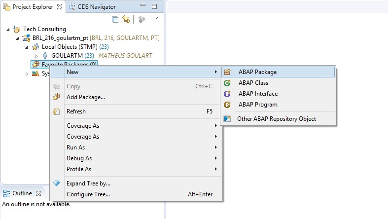
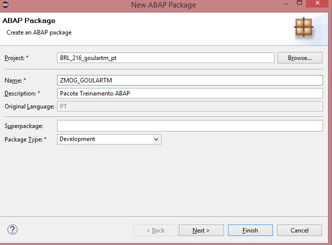
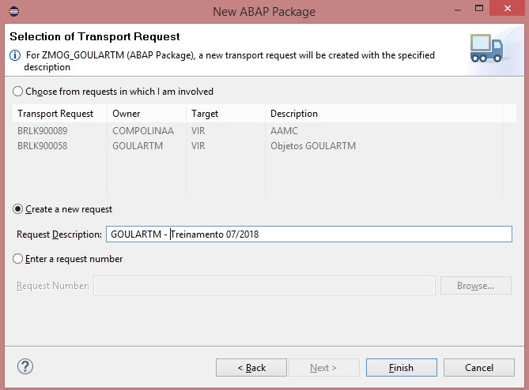
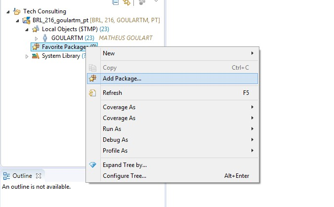
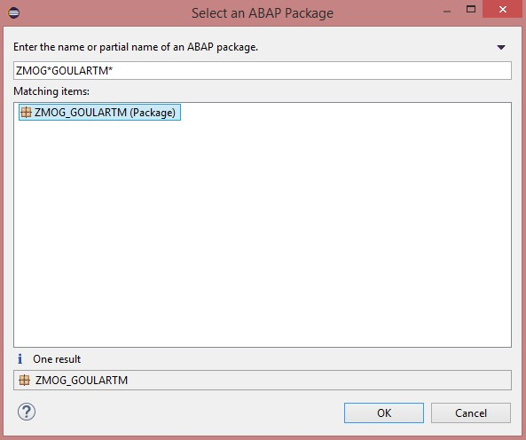
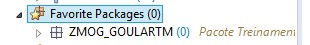

#Criar Pacote - ABAP

&nbsp;
## Contexto
&nbsp;

Criar pacote para os próximos desenvolvimentos/exercícios. 

##Pacote

Crie um novo pacote com o padrão de nomenclatura **ZMOG_USERNAME**, sendo "username" o nome do seu usuário:

&nbsp;
{: .center}

{: .center}

{: .center}
&nbsp;

Crie uma nova request para salvar o objeto (e os próximos objetos que serão criados nos próximos desenvolvimentos):

&nbsp;
{: .center}
&nbsp;

Adicione o pacote como favorito no seu usuário:

&nbsp;
{: .center}

{: .center}

{: .center}
&nbsp;