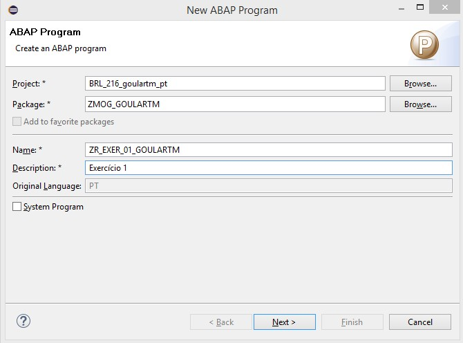
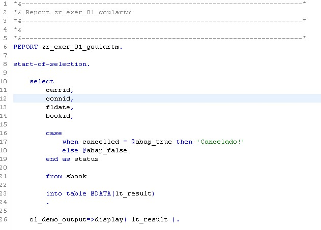

#Exercício 1 - ABAP

&nbsp;
## Contexto
&nbsp;

Nesse exercício vamos criar um programa que utilize novos comandos do OpenSQL. 

&nbsp;
{: .center}
&nbsp;

&nbsp;
{: .center}
&nbsp;

```
REPORT zr_exer_01_goulartm.

start-of-selection.

    select
        carrid,
        connid,
        fldate,
        bookid,

        case
            when cancelled = @abap_true then 'Cancelado!'
            else @abap_false
        end as status

        from sbook

        into table @DATA(lt_result)
        .

    cl_demo_output=>display( lt_result ).
```