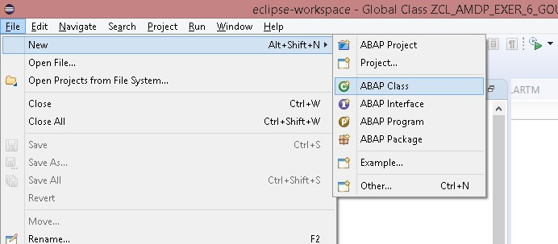
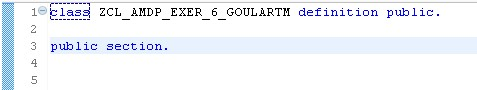
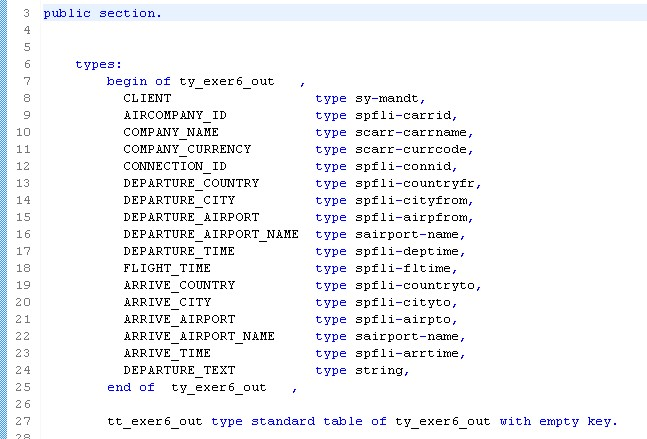
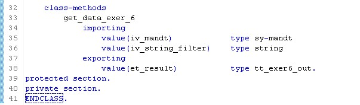
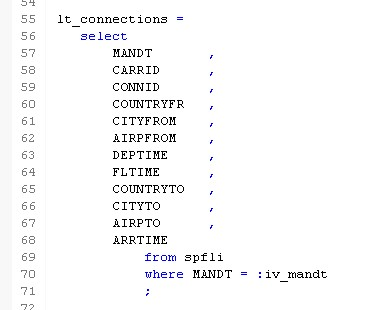
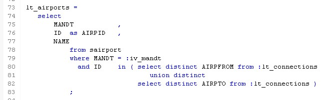
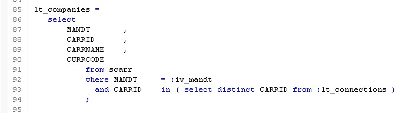
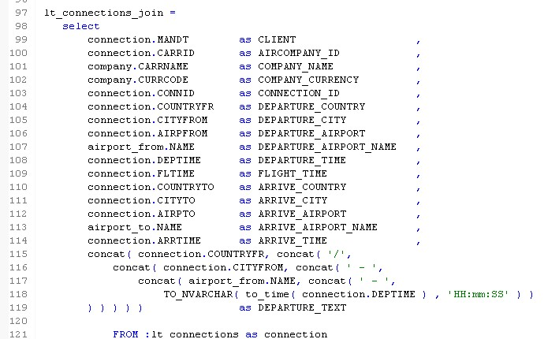
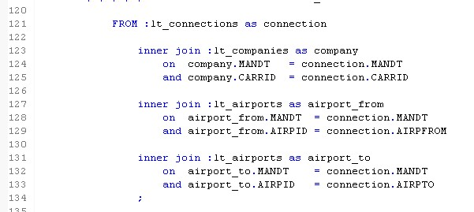
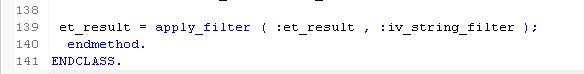

#Exercício 6 - ABAP

&nbsp;
## Contexto
&nbsp;

&nbsp;
{: .center}
&nbsp;

&nbsp;
{: .center}
&nbsp;

&nbsp;
{: .center}
&nbsp;

&nbsp;
{: .center}
&nbsp;

&nbsp;
{: .center}
&nbsp;

&nbsp;
{: .center}
&nbsp;

&nbsp;
{: .center}
&nbsp;

&nbsp;
{: .center}
&nbsp;

&nbsp;
{: .center}
&nbsp;

&nbsp;
{: .center}
&nbsp;

&nbsp;
{: .center}
&nbsp;

&nbsp;
{: .center}
&nbsp;

&nbsp;
{: .center}
&nbsp;


```

```