#Exercício 7 - ABAP

&nbsp;
## Contexto
&nbsp;

&nbsp;
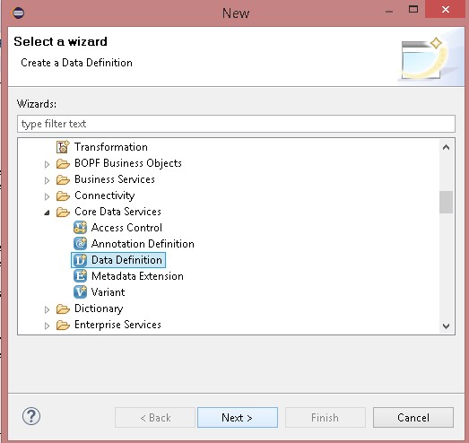{: .center}
&nbsp;

&nbsp;
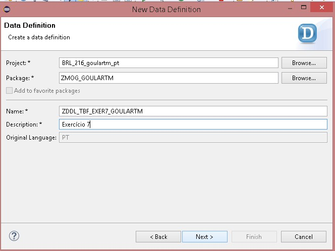{: .center}
&nbsp;

&nbsp;
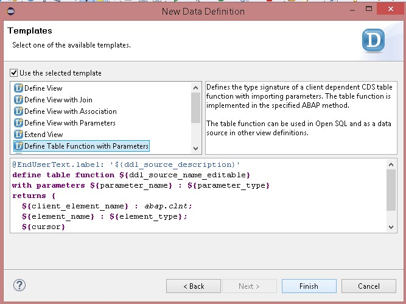{: .center}
&nbsp;

&nbsp;
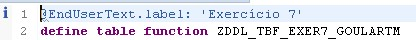{: .center}
&nbsp;

&nbsp;
{: .center}
&nbsp;

&nbsp;
{: .center}
&nbsp;

&nbsp;
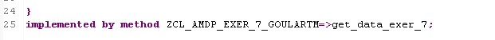{: .center}
&nbsp;

&nbsp;
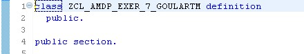{: .center}
&nbsp;

&nbsp;
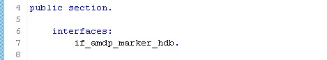{: .center}
&nbsp;

&nbsp;
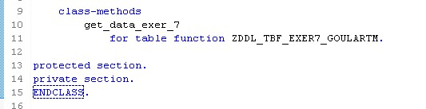{: .center}
&nbsp;

&nbsp;
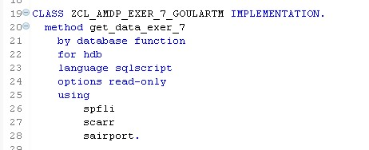{: .center}
&nbsp;

&nbsp;
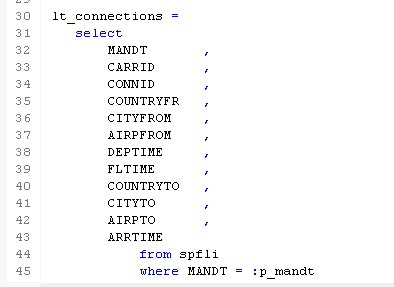{: .center}
&nbsp;

&nbsp;
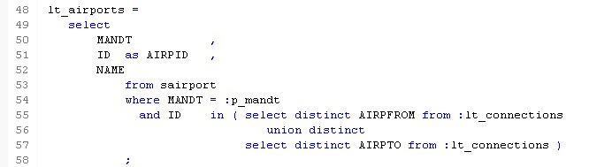{: .center}
&nbsp;

&nbsp;
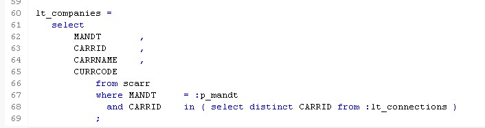{: .center}
&nbsp;

&nbsp;
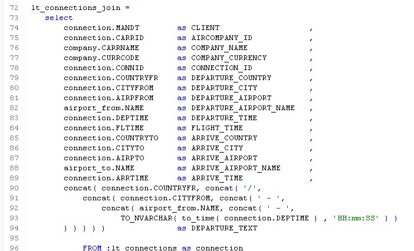{: .center}
&nbsp;

&nbsp;
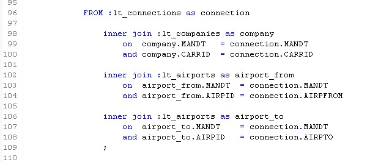{: .center}
&nbsp;

&nbsp;
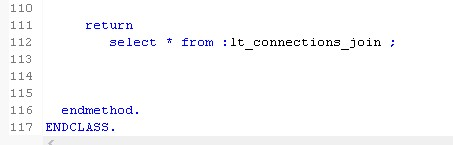{: .center}
&nbsp;

```

```