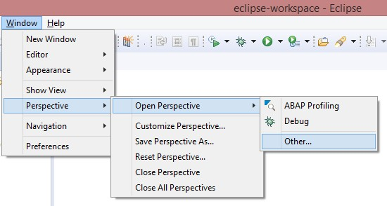
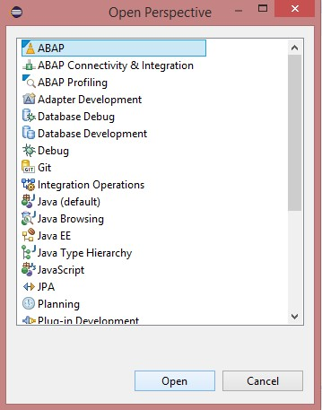
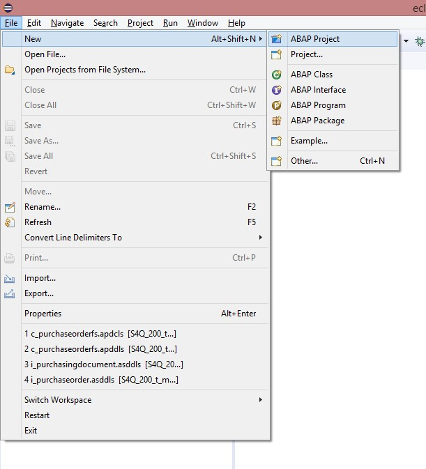
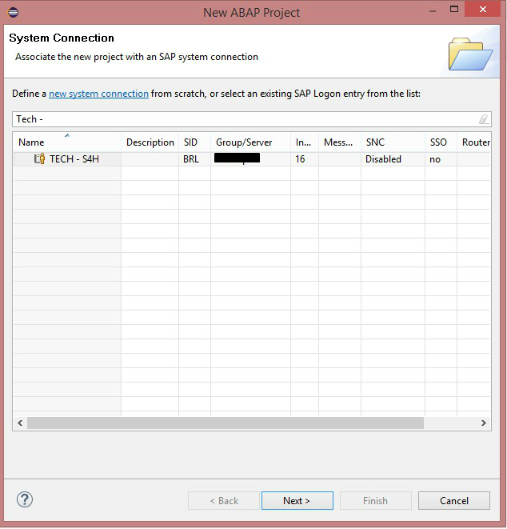
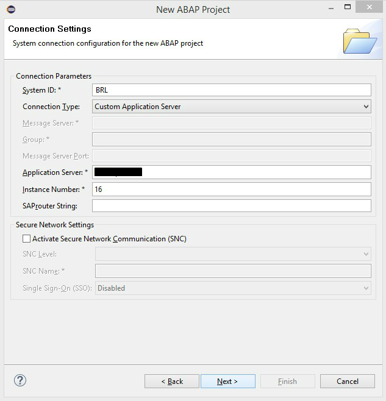
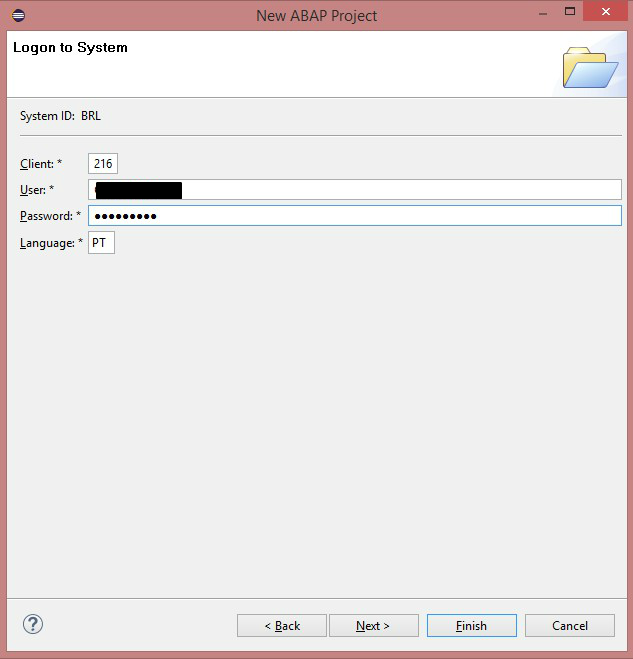
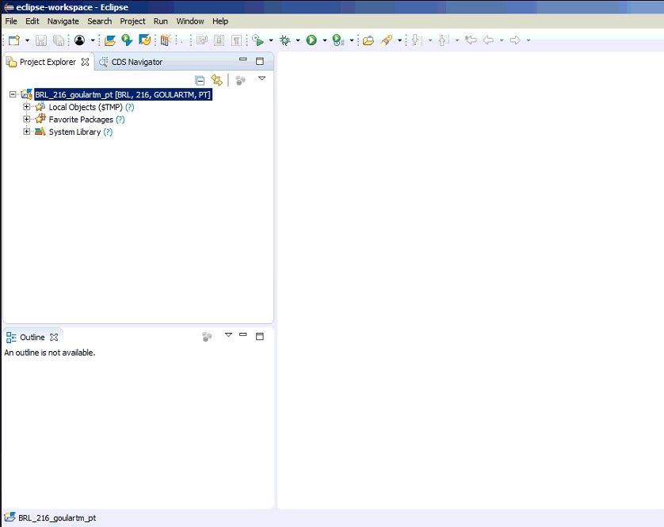

#Exercício 2 - Eclipse

&nbsp;
## Contexto
&nbsp;

Nesse exercício vamos aprender a como se conectar à um sistema Netweaver ABAP pelo Eclipse. 

&nbsp;
## Conectando ao ambiente ABAP
&nbsp;

Abra a perspectiva de ABAP Development no Eclipse em "**Window>Perspective>Open Perspective>Other**":

&nbsp;
{: .center}

{: .center}
&nbsp;

Com a perspectiva aberta, crie um novo projeto ABAP indo em "**File>New>ABAP Project**":

&nbsp;
{: .center}
&nbsp;

A tela exibida contém todos os sistemas configurados no seu SAP Logon. Selecione o sistema que deseja se conectar, clique em "Next" e depois em "Next" novamente:

&nbsp;
{: .center}

{: .center}
&nbsp;

Informe o mandante que deseja logar, usuário, senha e idioma. **ATENÇÃO** nesse passo, pois após finalizado a criãção do projeto, não é possível modificar nenhum dado (não é possivel depois logar no mesmo projeto em outro mandante, idioma ou com outro usuário). Caso queira logar em outro mandante, idioma ou com outro usuário, será preciso criar um novo projeto:

&nbsp;
{: .center}
&nbsp;

Com isso o projeto ABAP será criado e você estará conectado ao ambiente pelo Eclipse:

&nbsp;
{: .center}
&nbsp;