#Exercício 1 - HANA

&nbsp;
## Contexto
&nbsp;

Criar uma view que traga dados de conexões (SPFLI) somente com dados de partida dos voos (omitir informações de chegada dos voos). 
A view deve retornar as seguintes informações: 

&nbsp;

| Key | Campo | Origem | Hidden |
| --- | ----- | ------ | ------ |
| **X** | CLIENT | SPFLI-MANDT | |
| **X** | AIRCOMPANY_ID | SPFLI-CARRID | |
| | COMPANY_NAME | SCARR-CARRNAME | |
| | COMPANY_CURRENCY | SCARR-CURRCODE | |
| **X** | CONNECTION_ID | SPFLI-CONNID | |
| | DEPARTURE_COUNTRY | SPFLI-COUNTRYFR | |
| | DEPARTURE_CITY | SPFLI-CITYFROM | |
| | DEPARTURE_AIRPORT | SPFLI-AIRPFROM | |
| | DEPARTURE_AIRPORT_NAME | SAIRPORT-NAME | |
| | DEPARTURE_TIME | SPFLI-DEPTIME | |
| | FLIGHT_TIME | SPFLI-FLTIME | |
| | FLIGHT_DISTANCE | SPFLI-DISTANCE | |
| | FLIGHT_DISTANCE_UNIT | SPFLI-DISTID | |
| | FLIGHT_TYPE | SPFLI-FLTYPE | |
| | FLIGHT_DAYS | SPFLI-PERIOD | **X** |

&nbsp;
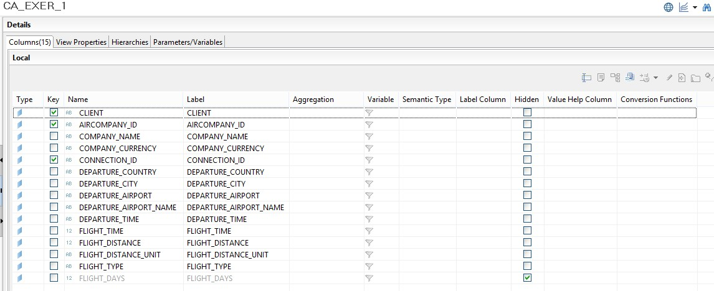{: .center}

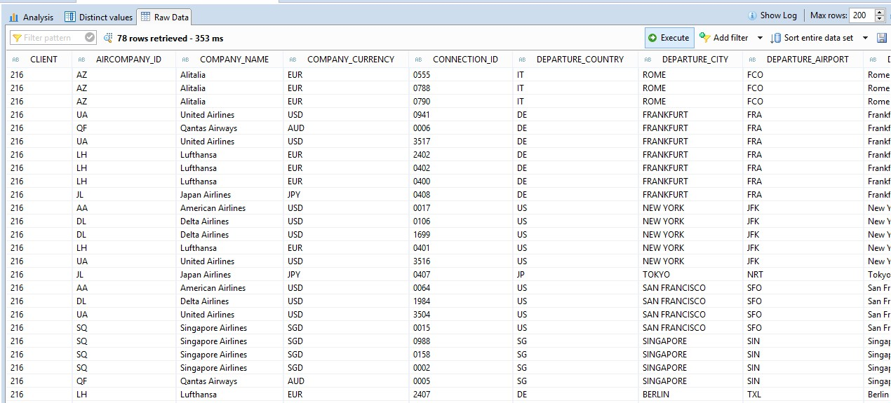{: .center}
&nbsp;

&nbsp;
## Calculation View
&nbsp;

Crie uma nova Calculation View indo em "File>New>Other" ou acessando o menu de contexto com o botão direito do mouse e indo em "New>Other":

&nbsp;
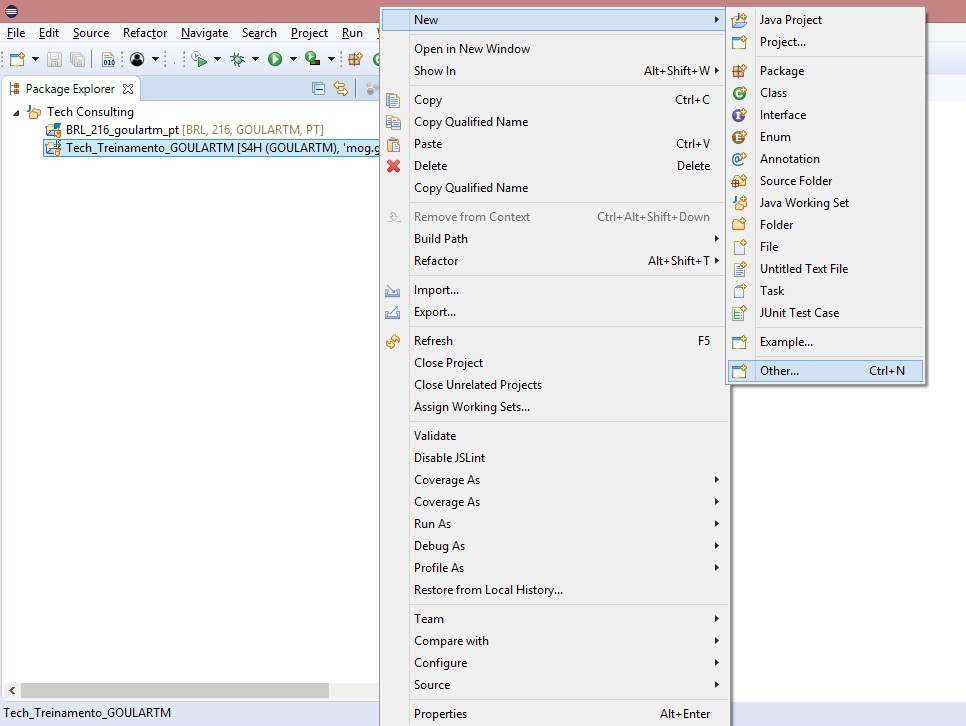{: .center}

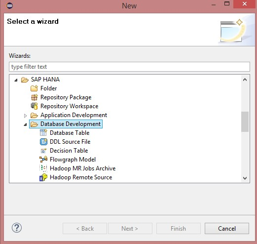{: .center}

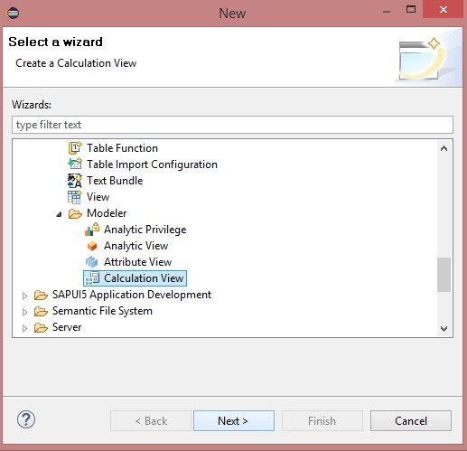{: .center}
&nbsp;

Vamos criar uma Calculation View do tipo Dimension. Use como no nome **CA_EXER_1_USERNAME**, sendo USERNAME o nome do seu usuário:

&nbsp;
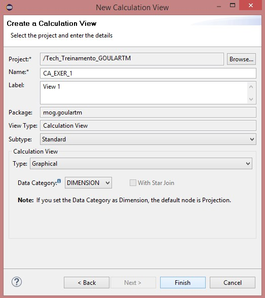{: .center}
&nbsp;

Crie um novo node do tipo **Projection**:

&nbsp;
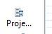{: .center}

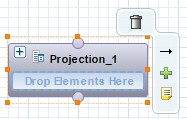{: .center}
&nbsp;

Adicione a tabela **SAPABAP1.SPFLI** (dados de conexões de vôos):

&nbsp;
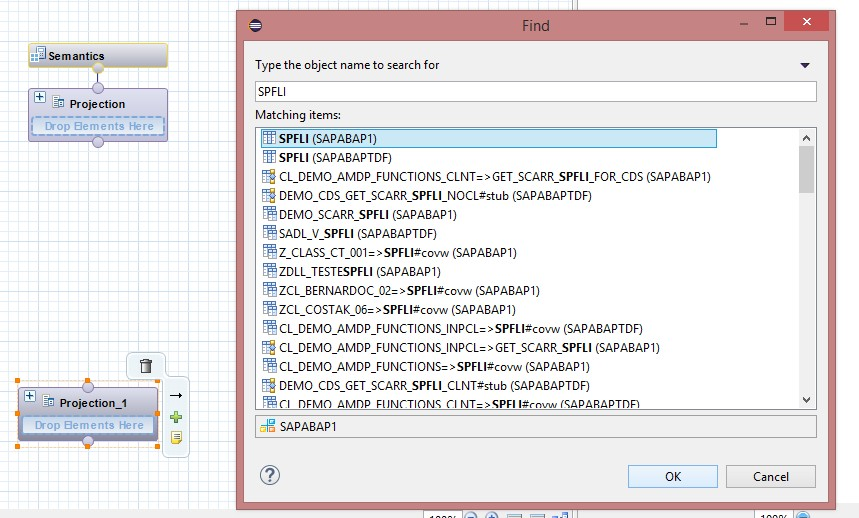{: .center}
&nbsp;

Adicione os seguintes campos à saída da Projection:

&nbsp;
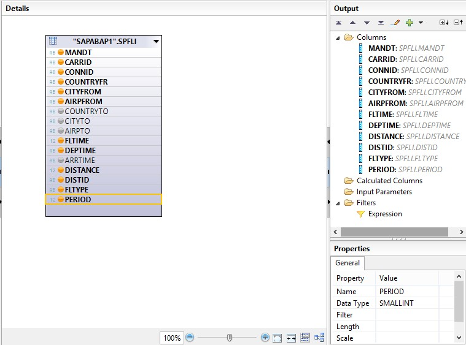{: .center}
&nbsp;

Renomeie os campos de saída da Projection:

&nbsp;
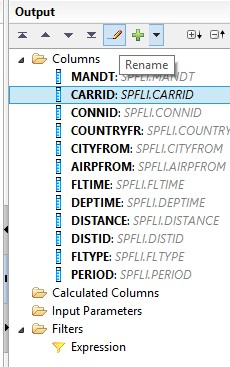{: .center}

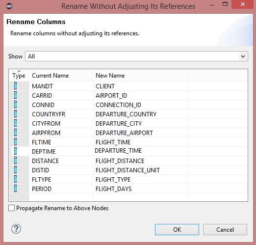{: .center}
&nbsp;

Reposicione os campos deixandos na seguinte ordem:

&nbsp;
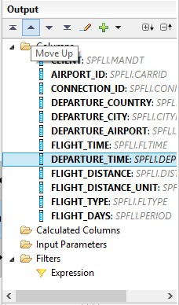{: .center}

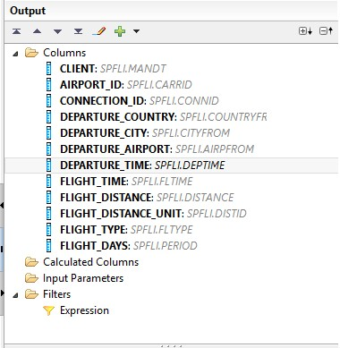{: .center}
&nbsp;

Renomeie a Projection para um nome mais significativo:

&nbsp;
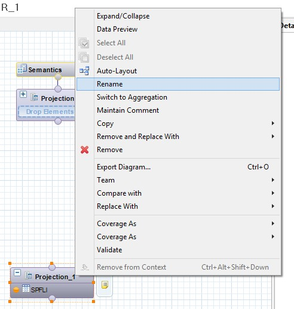{: .center}

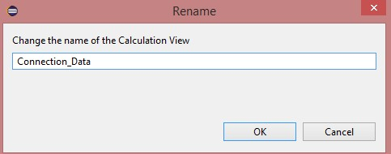{: .center}

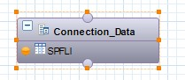{: .center}
&nbsp;

Adicione um novo node do tipo **Join**:

&nbsp;
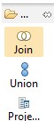{: .center}

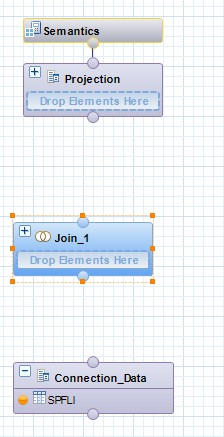{: .center}
&nbsp;

Use o node do tipo Join para unir a Projection **Connection_Data** e a tabela **SAPABAP1.SAIRPORT**:

&nbsp;
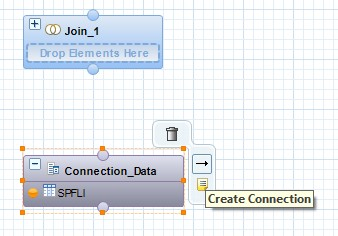{: .center}

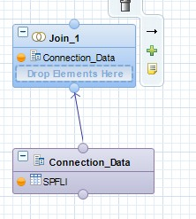{: .center}

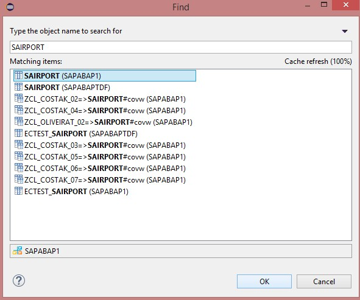{: .center}

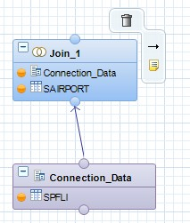{: .center}
&nbsp;

Renomeie o Join para um nome mais significativo:

&nbsp;
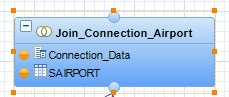{: .center}
&nbsp;

Faça a ligação dos campos do Join entre as duas entidades:

&nbsp;
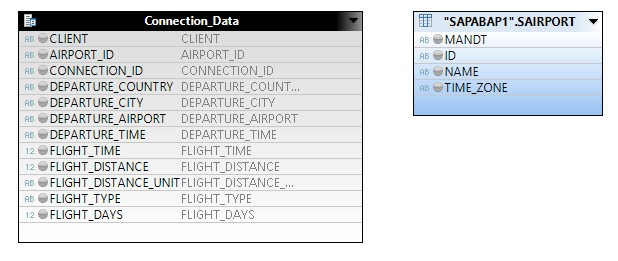{: .center}

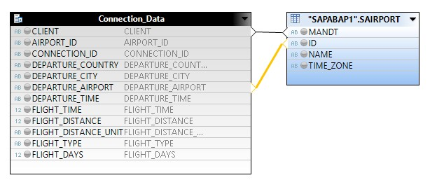{: .center}
&nbsp;

Use o Join do tipo Referrential:

&nbsp;
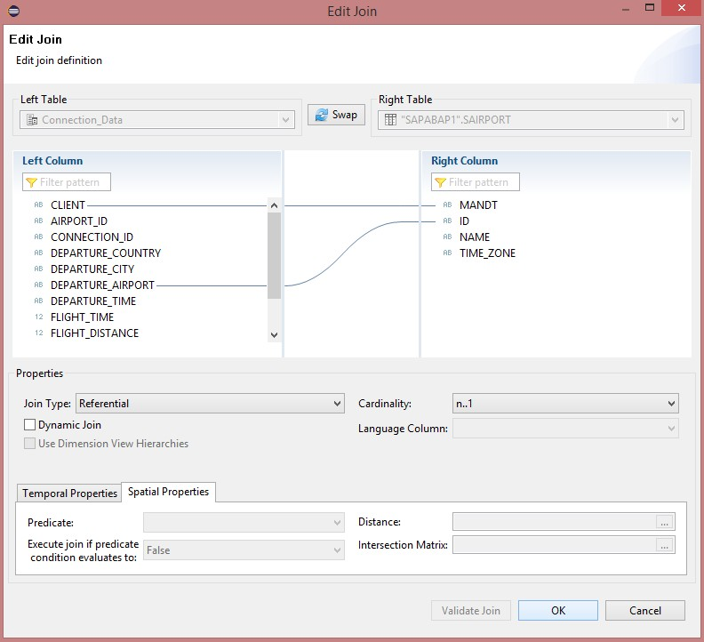{: .center}
&nbsp;

Adicione os campos a seguir para os campos de saída do Join:

&nbsp;
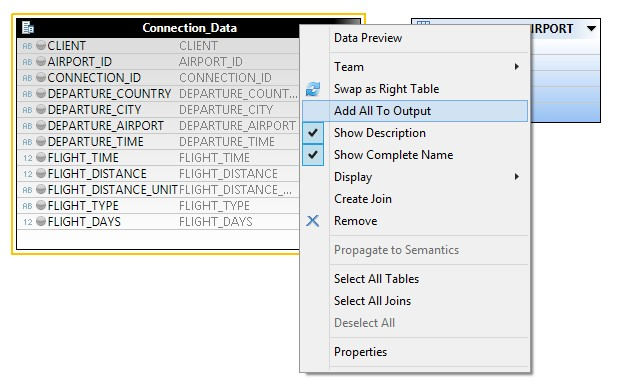{: .center}

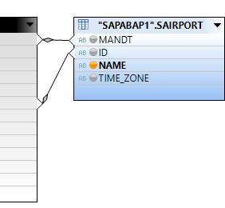{: .center}

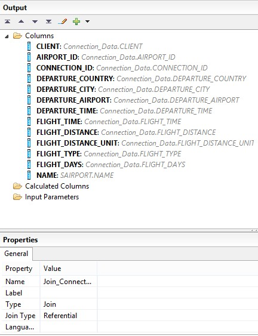{: .center}
&nbsp;

Renomeie o campo **NAME** para um label mais significativo:

&nbsp;
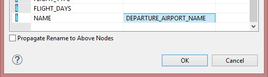{: .center}

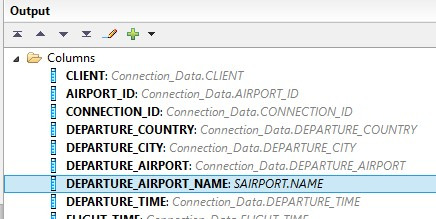{: .center}
&nbsp;

Crie um novo node do tipo Join entre o **Join_Connection_Airport** e a tabela **SAPABAP1.SCARR**, adicionando os seguintes campos de saída:

&nbsp;
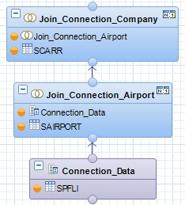{: .center}

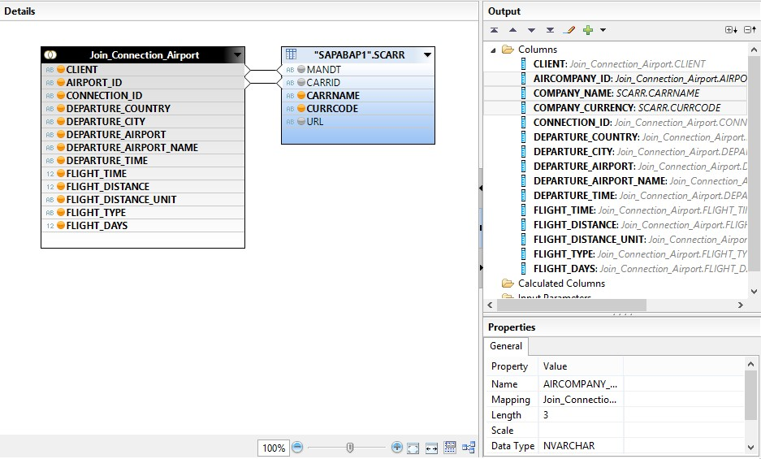{: .center}

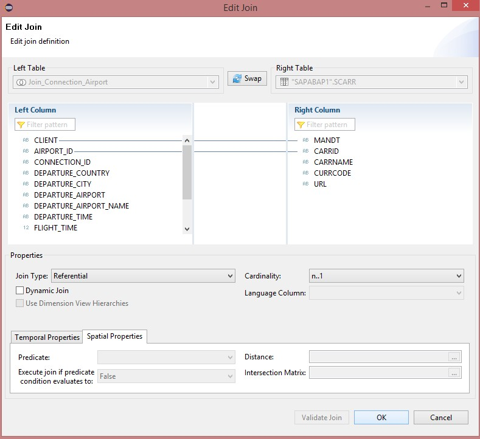{: .center}
&nbsp;

Adicione o Join a Projection final de saída da Calculation View:

&nbsp;
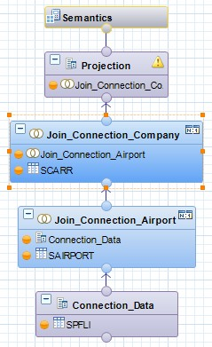{: .center}

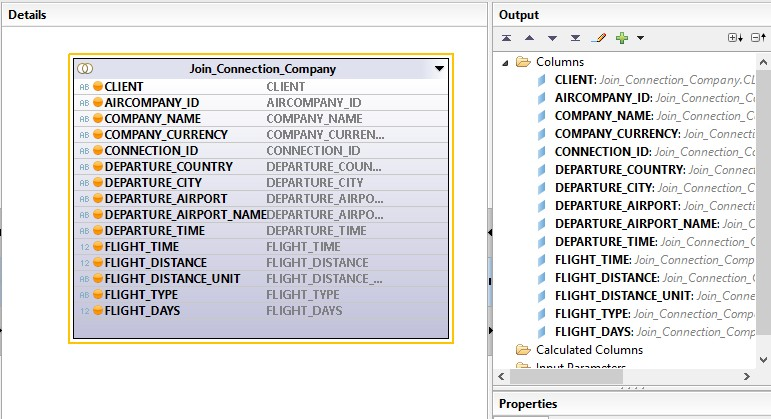{: .center}

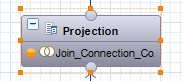{: .center}
&nbsp;

Clique no node de **Semantics**:

&nbsp;
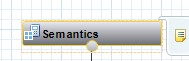{: .center}
&nbsp;

Marque o campo **Flight_Days** como **Hidden**:

&nbsp;
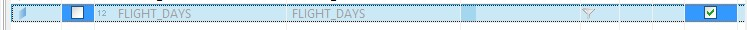{: .center}
&nbsp;

Marque os campos que são chave primária da View:

&nbsp;
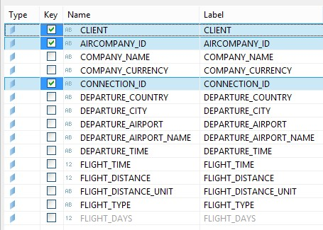{: .center}
&nbsp;

Vá na aba **Properties** e ajuste o **Default Client** de **Session Client** para **Cross Client**:

&nbsp;
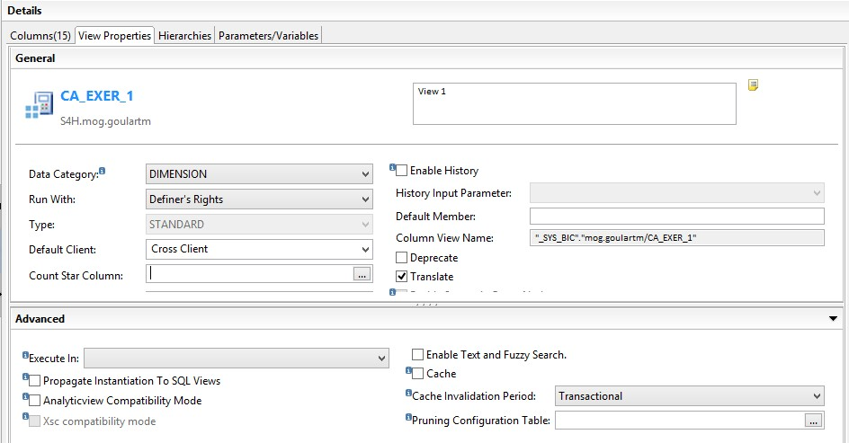{: .center}
&nbsp;

Salve e ative a view:

&nbsp;
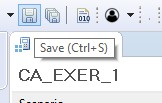{: .center}

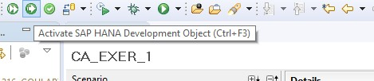{: .center}

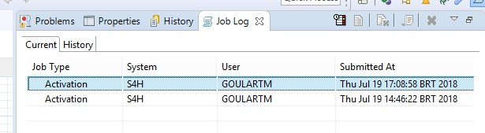{: .center}
&nbsp;

Para visualizar os dados da view, clique em **Data Preview**:

&nbsp;
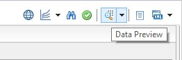{: .center}

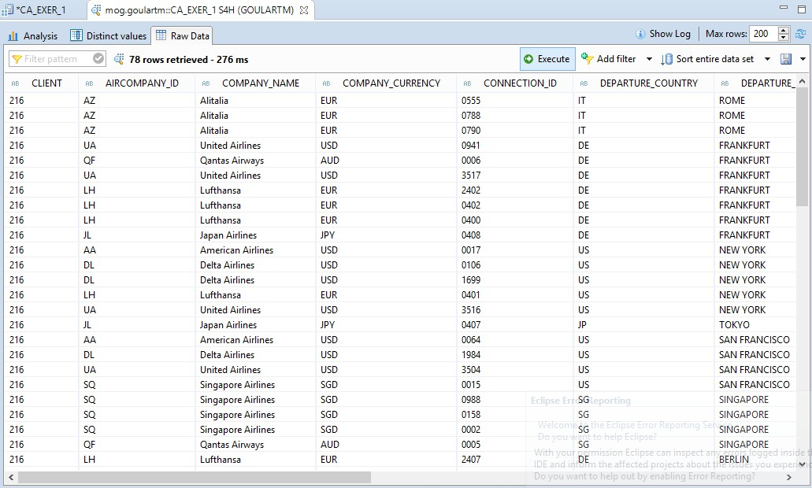{: .center}
&nbsp;