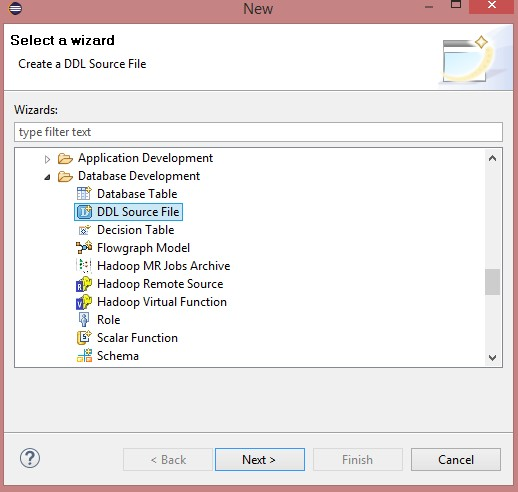
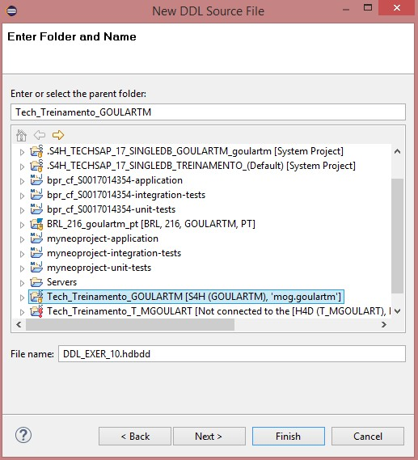
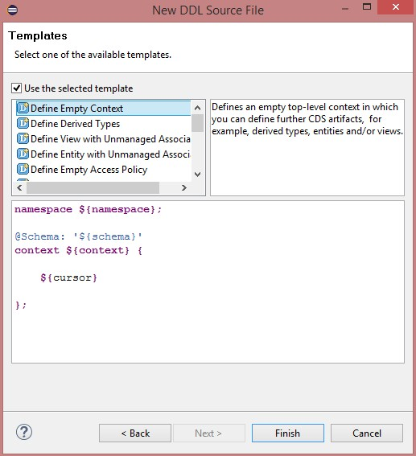
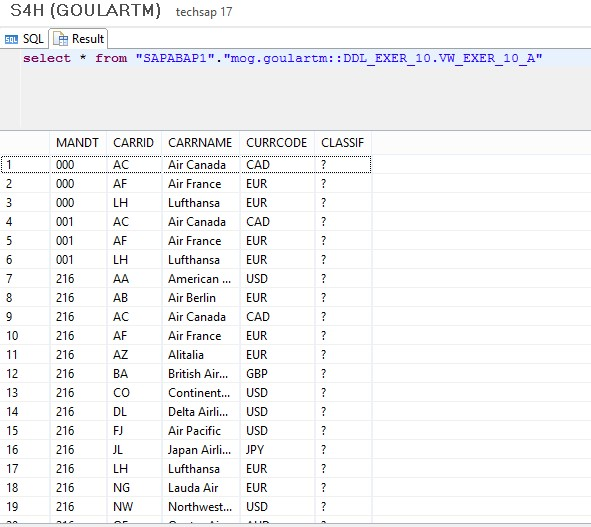

#Exercício 10 - HANA

&nbsp;
## Contexto
&nbsp;

Criar uma view que traga dados de conexões (SPFLI) somente com dados de partida dos voos (omitir informações de chegada dos voos). 
A view deve retornar as seguintes informações: 

&nbsp;

| Key | Campo | Origem | Hidden |
| --- | ----- | ------ | ------ |
| **X** | CLIENT | SPFLI-MANDT | |
| **X** | AIRCOMPANY_ID | SPFLI-CARRID | |
| | COMPANY_NAME | SCARR-CARRNAME | |
| | COMPANY_CURRENCY | SCARR-CURRCODE | |
| **X** | CONNECTION_ID | SPFLI-CONNID | |
| | DEPARTURE_COUNTRY | SPFLI-COUNTRYFR | |
| | DEPARTURE_CITY | SPFLI-CITYFROM | |
| | DEPARTURE_AIRPORT | SPFLI-AIRPFROM | |
| | DEPARTURE_AIRPORT_NAME | SAIRPORT-NAME | |
| | DEPARTURE_TIME | SPFLI-DEPTIME | |
| | FLIGHT_TIME | SPFLI-FLTIME | |
| | FLIGHT_DISTANCE | SPFLI-DISTANCE | |
| | FLIGHT_DISTANCE_UNIT | SPFLI-DISTID | |
| | FLIGHT_TYPE | SPFLI-FLTYPE | |
| | FLIGHT_DAYS | SPFLI-PERIOD | **X** |

&nbsp;
{: .center}
&nbsp;

&nbsp;
{: .center}
&nbsp;

&nbsp;
{: .center}
&nbsp;

&nbsp;
{: .center}
&nbsp;

&nbsp;
{: .center}
&nbsp;

&nbsp;
{: .center}
&nbsp;

&nbsp;
{: .center}
&nbsp;