#Exercício 2 - HANA

&nbsp;
## Contexto
&nbsp;

Criar uma view que traga dados de conexões (SPFLI) somente com dados de chegada dos voos (omitir informações de partida dos voos). 
A view será o inverso da view criada no exercício 1.

| Key | Campo | Origem |
| --- | ----- | ------ |
| **X** | MANDT | SPFLI-MANDT |
| **X** | CARRID | SPFLI-CARRID |
| | CARRNAME | SCARR-CARRNAME |
| **X** | CONNID | SPFLI-CONNID |
| | COUNTRYTO | SPFLI-COUNTRYTO |
| | CITYTO | SPFLI-CITYTO |
| | AIRPTO | SPFLI-AIRPTO |
| | NAME | SAIRPORT-NAME |
| | DEPARTURE_TIME | SPFLI-DEPTIME |
| | ARRTIME | SPFLI-ARRTIME |

&nbsp;
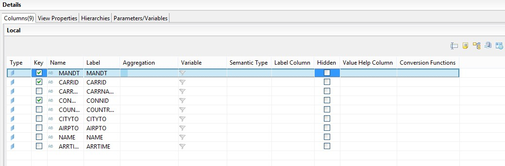{: .center}

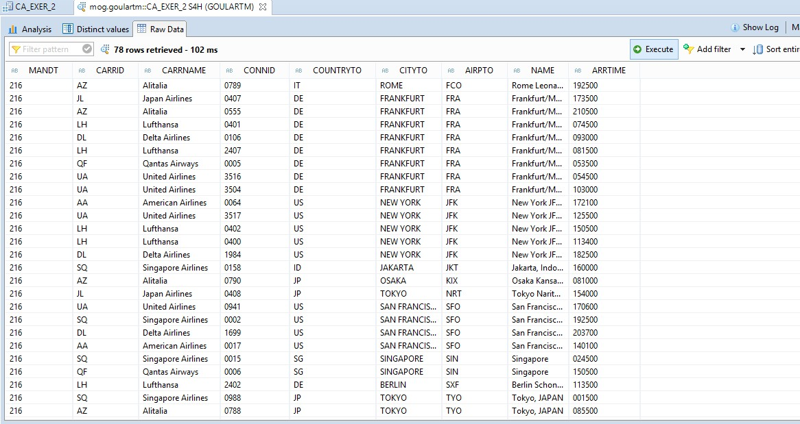{: .center}
&nbsp;

&nbsp;
## Calculation View
&nbsp;

Crie uma nova Calculation View do tipo Dimension:

&nbsp;
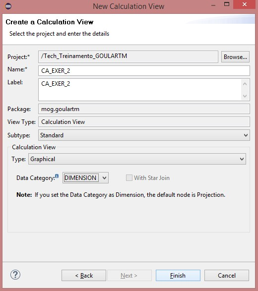{: .center}
&nbsp;

Adicione um projection da tabela SAPABAP1.SPFLI: 

&nbsp;
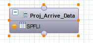{: .center}

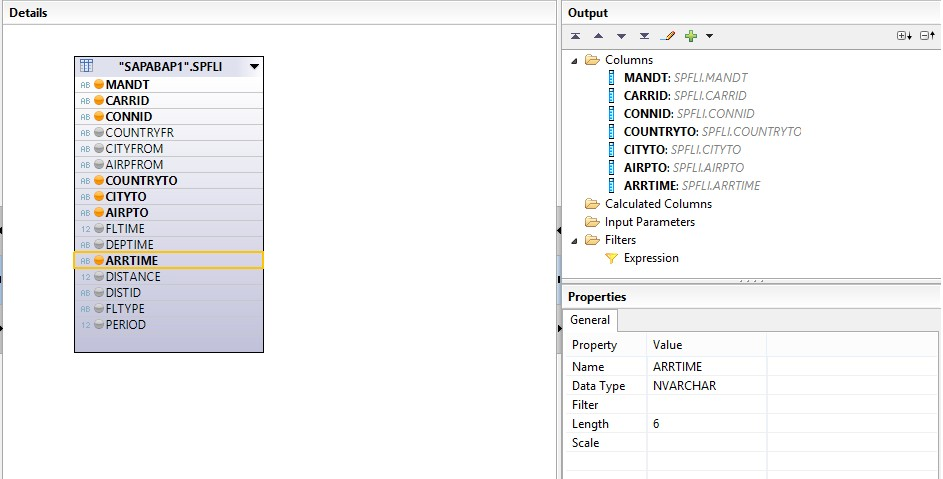{: .center}
&nbsp;

Crie um novo node do tipo Join para unir a Projection **Proj_Arrive_Data** e a tabela **SAPABAP1.SAIRPORT**:

&nbsp;
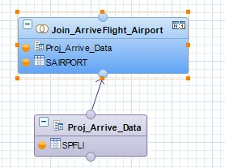{: .center}

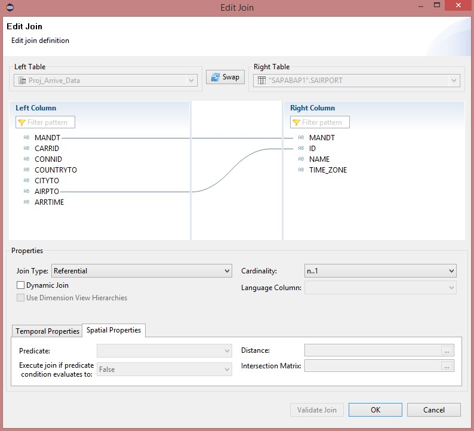{: .center}

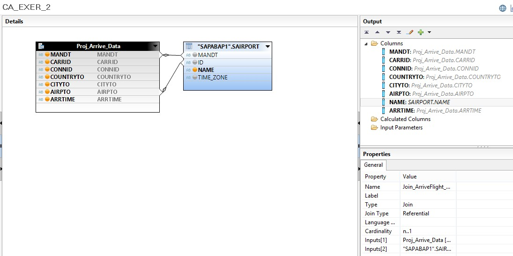{: .center}
&nbsp;

Crie um novo node do tipo Join para unir o Join **Join_ArriveFlight_Airport** e a tabela **SAPABAP1.SCARR**:

&nbsp;
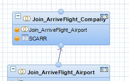{: .center}

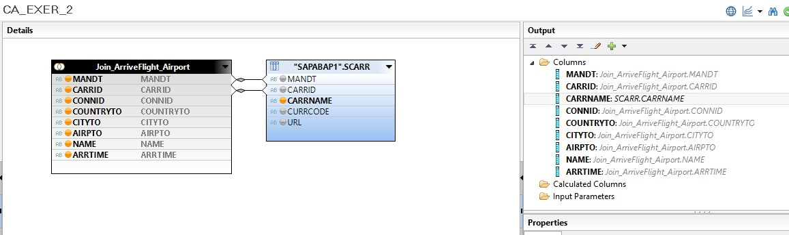{: .center}
&nbsp;

Adicione o Join **Join_ArriveFlight_Company** a Projection final de saída da Calculation View:

&nbsp;
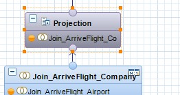{: .center}

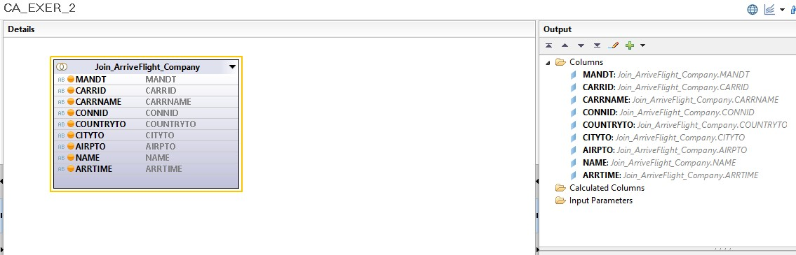{: .center}
&nbsp;

Na aba de **Semantics**, defina os campos de chave primária e mude o **Default Client** na aba de **Properties**:

&nbsp;
{: .center}

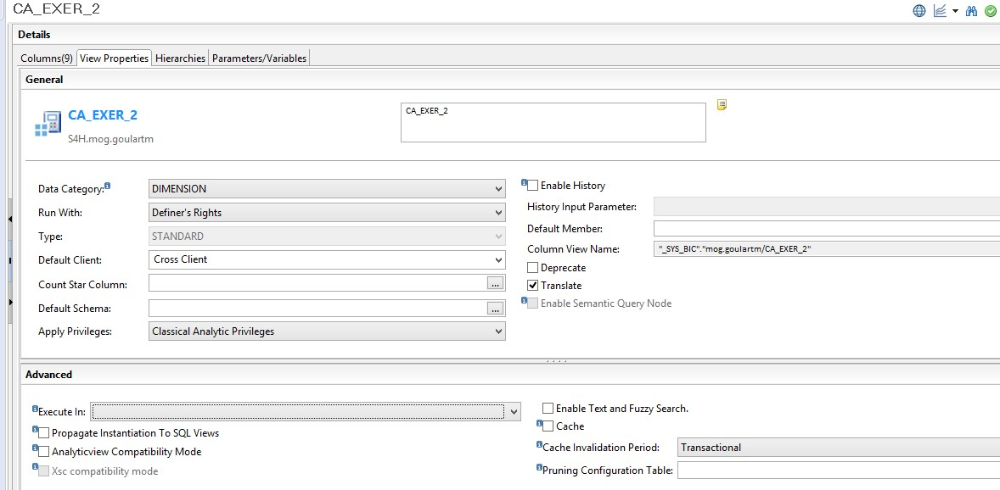{: .center}
&nbsp;

Salve, ative e teste a view:

&nbsp;
{: .center}
&nbsp;