#Exercício 3 - HANA

&nbsp;
## Contexto
&nbsp;

Criar uma view que unifique os dados das duas views criadas nos exercícios anteriores.  somente com dados de partida dos voos (omitir informações de chegada dos voos). 
A view deve retornar as seguintes informações: 

&nbsp;

| Key | Campo | Origem | Hidden |
| --- | ----- | ------ | ------ |
| **X** | CLIENT | CA_EXER_1-CLIENT | |
| **X** | AIRCOMPANY_ID | CA_EXER_1-AIRCOMPANY_ID | |
| | COMPANY_NAME | CA_EXER_1-COMPANY_NAME | |
| | COMPANY_CURRENCY | CA_EXER_1-COMPANY_CURRENCY | |
| **X** | CONNECTION_ID | CA_EXER_1-CONNECTION_ID | |
| | DEPARTURE_COUNTRY | CA_EXER_1-DEPARTURE_COUNTRY | |
| | DEPARTURE_CITY | CA_EXER_1-DEPARTURE_CITY | |
| | DEPARTURE_AIRPORT | CA_EXER_1-DEPARTURE_AIRPORT | |
| | DEPARTURE_AIRPORT_NAME | CA_EXER_1-DEPARTURE_AIRPORT_NAME | |
| | DEPARTURE_TIME | CA_EXER_1-DEPARTURE_TIME | |
| | FLIGHT_TIME | CA_EXER_1-FLIGHT_TIME | |
| | FLIGHT_DISTANCE | CA_EXER_1-FLIGHT_DISTANCE | |
| | FLIGHT_DISTANCE_UNIT | CA_EXER_1-FLIGHT_DISTANCE_UNIT | |
| | FLIGHT_TYPE | CA_EXER_1-FLIGHT_TYPE | |
| | ARRIVE_COUNTRY | CA_EXER_2-COUNTRYTO | |
| | ARRIVE_CITY | CA_EXER_2-CITYTO | |
| | ARRIVE_AIRPORT | CA_EXER_2-AIRPTO | |
| | ARRIVE_AIRPORT_NAME | CA_EXER_2-NAME | |
| | ARRIVE_TIME | CA_EXER_2-ARRTIME | |
| | DEPARTURE_TEXT | CALCULATED COLUMN | |

| Calculated Column | Valor | Tipo |
| ----------------- | ----- | ---- |
| DEPARTURE_TEXT | Concatenar campos DEPARTURE_COUNTRY + DEPARTURE_CITY + DEPARTURE_AIRPORT_NAME + DEPARTURE_TIME | NVARCHAR(100) |

&nbsp;
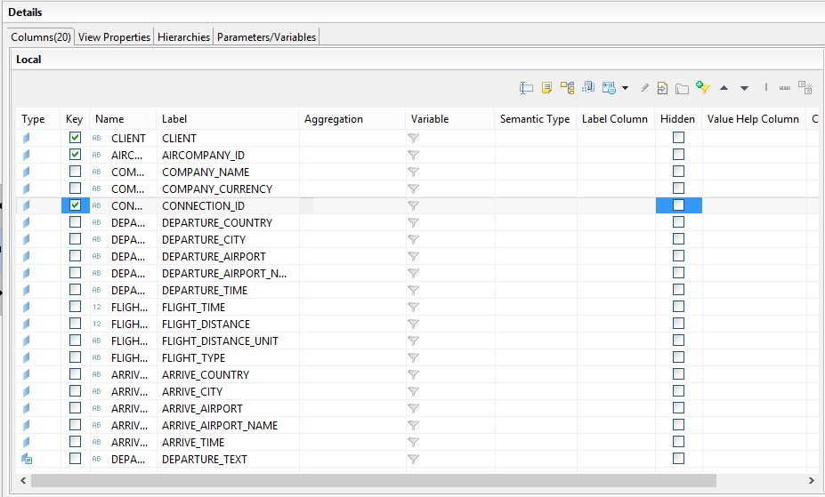{: .center}
&nbsp;

&nbsp;
## Calculation View
&nbsp;

Crie uma nova Calculation View do tipo Dimension:

&nbsp;
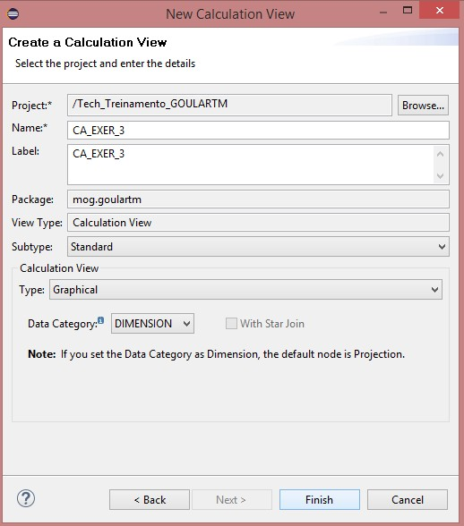{: .center}
&nbsp;

Crie um node do tipo Join que faça o **inner join** das views criadas nos exercícios anteriores (CA_EXER_1 e CA_EXER_2):

&nbsp;
{: .center}

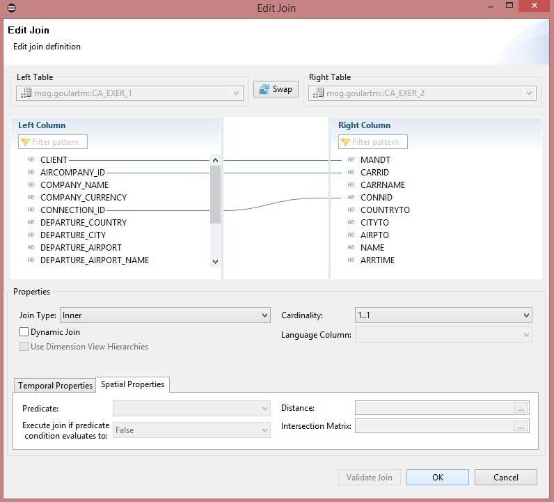{: .center}

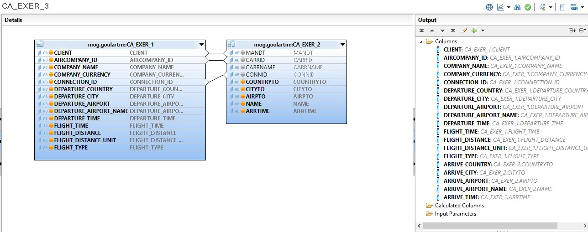{: .center}
&nbsp;

Renomeie as colunas:

&nbsp;
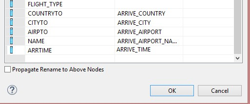{: .center}
&nbsp;

Adicione o Join **Join_Departure_Arrive** a Projection final de saída da Calculation View:

&nbsp;
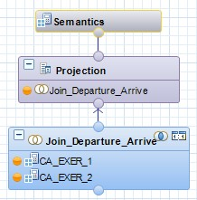{: .center}

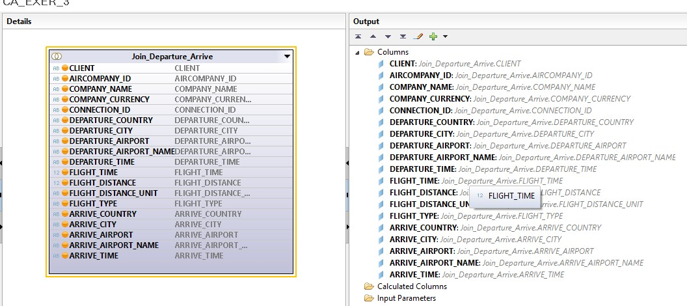{: .center}
&nbsp;

Crie um novo campo calculado:

&nbsp;
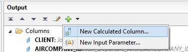{: .center}

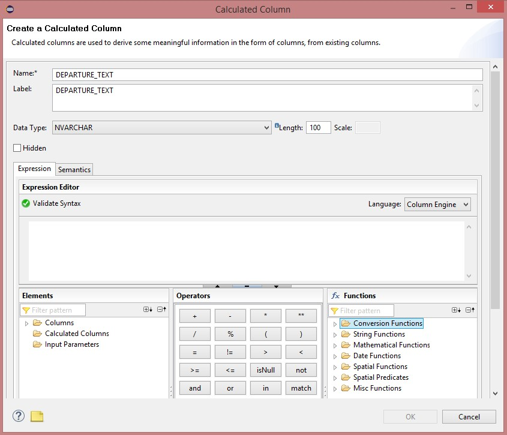{: .center}
&nbsp;

O campo irá concatenar as informações de **DEPARTURE** para formar um texto de exibição:

```
string(  
"DEPARTURE_COUNTRY" + '/' + "DEPARTURE_CITY" + ' - ' + 
"DEPARTURE_AIRPORT_NAME" + ' - ' + string( time( "DEPARTURE_TIME" ) )
)
```

&nbsp;
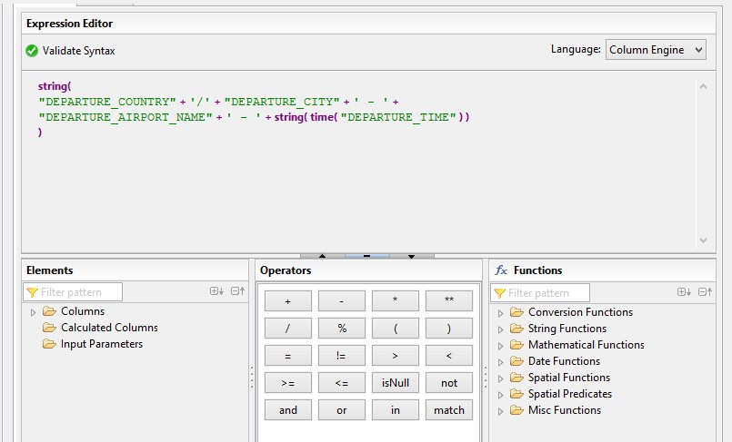{: .center}

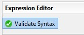{: .center}

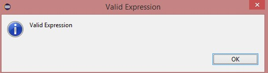{: .center}

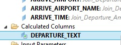{: .center}
&nbsp;

Na aba de **Semantics**, defina os campos de chave primária e mude o **Default Client** na aba de **Properties**:

&nbsp;
{: .center}

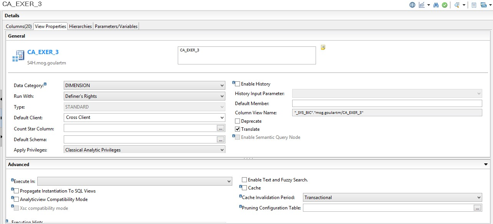{: .center}
&nbsp;

Salve, ative e teste a view.