#Exercício 4 - HANA

&nbsp;
## Contexto
&nbsp;

Criar uma view que traga o total arrecadado com vôos pelas companhias aéreas, quebrando o montante por período, ano e conexão. Dados de voos (SFLIGHT) devem ser somados para chegar ao resultado esperado. 

A view deve retornar as seguintes informações: 

&nbsp;

| Key | Campo | Origem |
| --- | ----- | ------ |
| **X** | MANDT | SFLIGHT-MANDT |
| **X** | CARRID | SFLIGHT-CARRID |
| **X** | CONNID | SFLIGHT-CONNID |
| **X** | FLYEAR | Calculated Column |
| **X** | FLPERIO | Calculated Column |
| | PAYMENTSUM | SFLIGHT-PAYMENTSUM |

| Calculated Column | Valor | Tipo |
| ----------------- | ----- | ---- |
| FLYEAR | Ano do campo SFLIGHT-FLDATE | NVARCHAR(4) |
| FLPERIO | Ano + Mês do campo SFLIGHT-FLDATE | NVARCHAR(6) |

&nbsp;
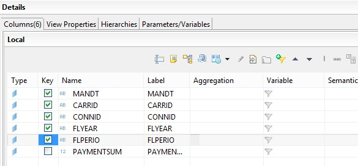{: .center}
&nbsp;

&nbsp;
## Calculation View
&nbsp;

Crie uma nova Calculation View do tipo Dimension:

&nbsp;
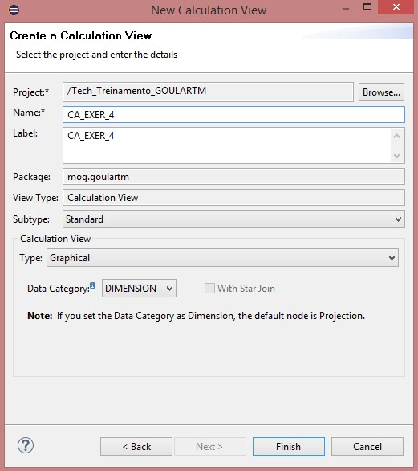{: .center}
&nbsp;

Adicione um projection da tabela SAPABAP1.SFLIGHT: 

&nbsp;
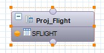{: .center}

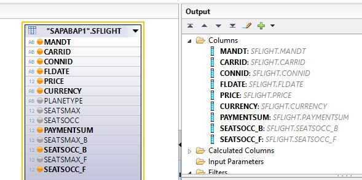{: .center}
&nbsp;

Crie três calculated columns, FLYEAR, FLPERIO e PRICE_FIRST_CLASS:

&nbsp;
```
leftstr("FLDATE",6)
```
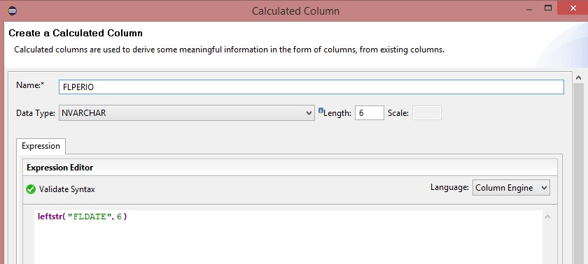{: .center}
&nbsp;

&nbsp;
```
leftstr("FLDATE",4)
```
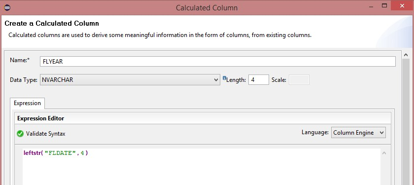{: .center}
&nbsp;

&nbsp;
```
if("SEATSOCC_F" > 0, 
    if("PAYMENTSUM" > 0 , 
        (("PAYMENTSUM" - ("SEATSOCC_B" * "PRICE")) / "SEATSOCC_F") , 
        "PRICE") ,
    0
)
```
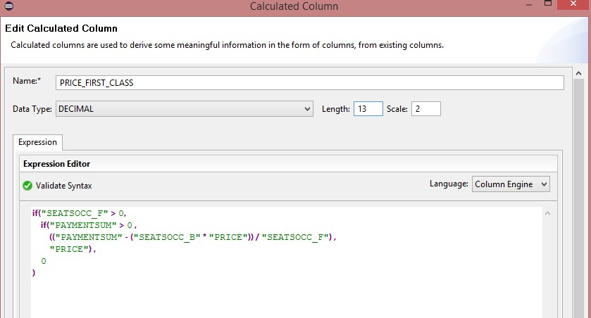{: .center}

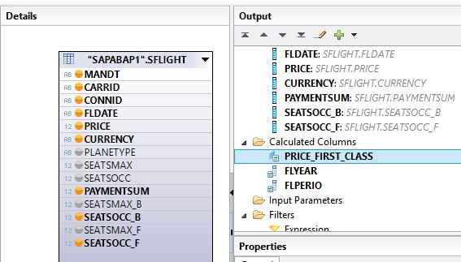{: .center}
&nbsp;

Adicione um novo node do tipo Aggregation para sumarizar o campo **PAYMENTSUM**:

&nbsp;
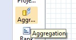{: .center}

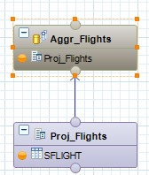{: .center}
&nbsp;

Selecione os campos desejados:

&nbsp;
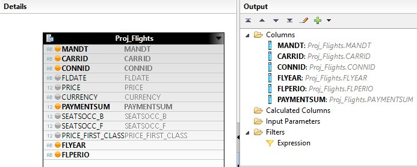{: .center}
&nbsp;

Converta o campo **PAYMENTSUM** para uma coluna de agregação, e depois faça um SUM no campo:

&nbsp;
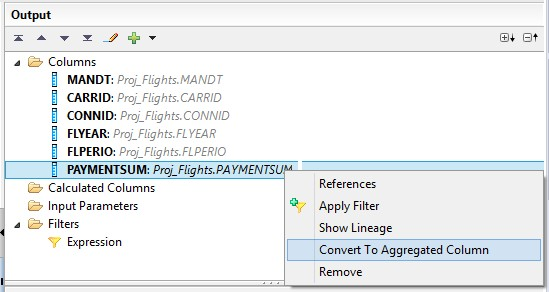{: .center}

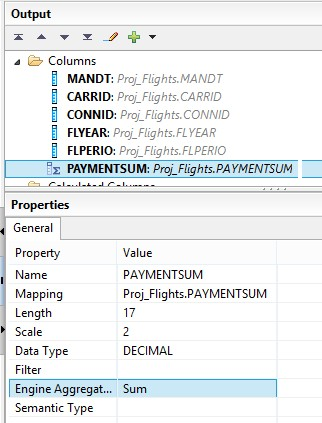{: .center}
&nbsp;

Adicione a Aggregation **Aggr_Flights** a Projection final de saída da Calculation View: 

&nbsp;
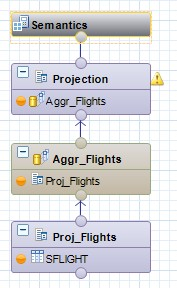{: .center}

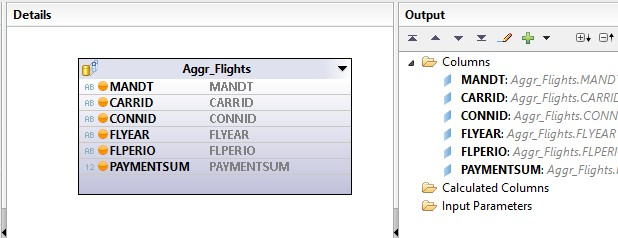{: .center}
&nbsp;

Na aba de **Semantics**, defina os campos de chave primária e mude o **Default Client** na aba de **Properties**:

&nbsp;
{: .center}

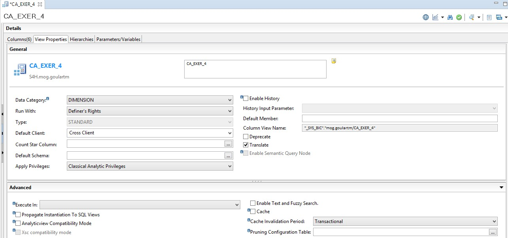{: .center}
&nbsp;

Salve, ative e teste a view.