#Exercício 5 - HANA

&nbsp;
## Contexto
&nbsp;

Criar uma view que traga dados da view do exercício anterior (CA_EXER_4), fazendo a somatória do valor arrecadado por companhia, conexão e ano. O resultado também deve ter um ranqueamento geral de todas as companhias, mostrando um rank das conexões que mais arrecadaram. 

A view deve retornar as seguintes informações: 

&nbsp;

| Key | Campo | Origem | 
| --- | ----- | ------ |
| **X** | MANDT | CA_EXER_4-MANDT |
| **X** | CARRID | CA_EXER_4-CARRID |
| **X** | CONNID | CA_EXER_4-CONNID |
| **X** | FLYEAR | CA_EXER_4-FLYEAR |
| | PAYMENTSUM | SUM( CA_EXER_4-PAYMENTSUM ) |

&nbsp;
## Calculation View
&nbsp;

Crie uma nova Calculation View do tipo Dimension:

&nbsp;
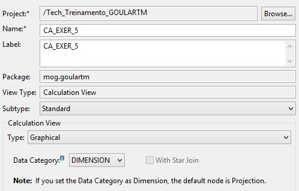{: .center}
&nbsp;

Adicione um node de Aggregation que fará a somatória do campo CA_EXER_4.PAYMENTSUM:

&nbsp;
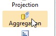{: .center}

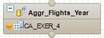{: .center}

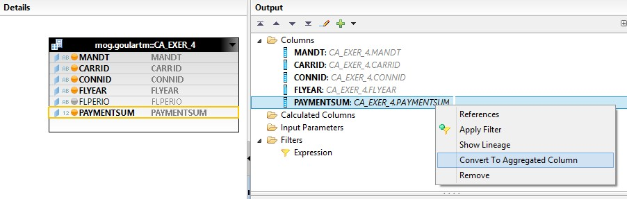{: .center}

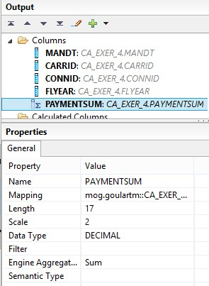{: .center}
&nbsp;

Crie um novo node do tipo **Rank**, que fará o ranqueamento da Aggregation **Aggr_Flights_Year**.

&nbsp;
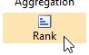{: .center}

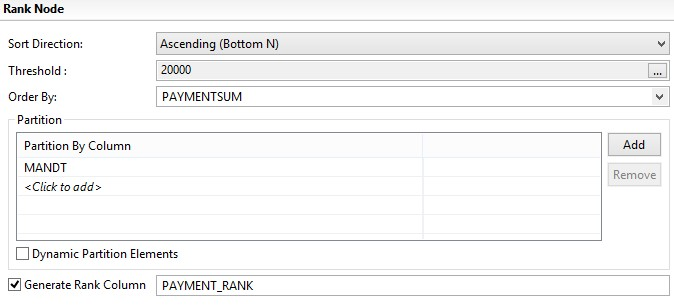{: .center}
&nbsp;

Adicione o Rank **Rank_Flights_Year** a Projection final de saída da Calculation View: 

&nbsp;
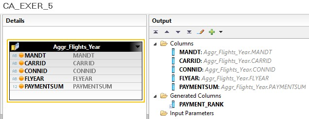{: .center}

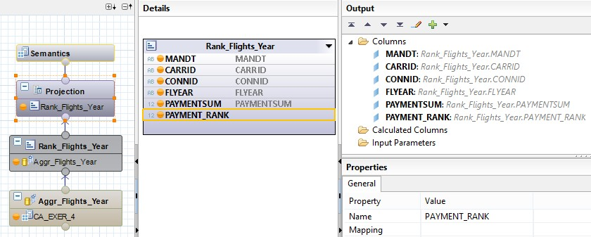{: .center}
&nbsp;

Na aba de **Semantics**, defina os campos de chave primária e mude o **Default Client** na aba de **Properties**:

&nbsp;
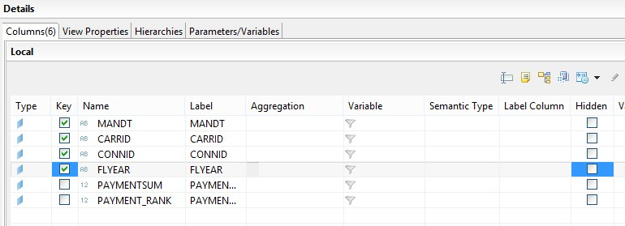{: .center}

{: .center}
&nbsp;

Salve, ative e teste a view.

&nbsp;
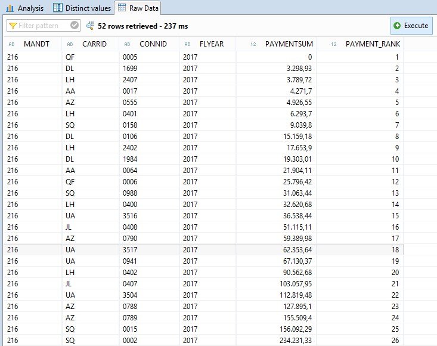{: .center}
&nbsp;