#Exercício 6 - HANA

&nbsp;
## Contexto
&nbsp;

Criar uma view que traga dados de quantas vezes os aeroportos foram destinos de conexões (ARRIVE e DEPARTURE), tendo assim uma relação dos aeroportos com maior número de conexões.

A view deve retornar as seguintes informações: 

&nbsp;

| Key | Campo | Origem |
| --- | ----- | ------ |
| **X** | MANDT | SPFLI-MANDT |
| **X** | AIRPFROM | SPFLI-AIRPFROM e SPFLI-AIRPTO (UNION) |
| | NO_CONNECTIONS_INT | COUNT(*) |


&nbsp;
## Calculation View
&nbsp;

Crie uma nova Calculation View do tipo Dimension:

&nbsp;
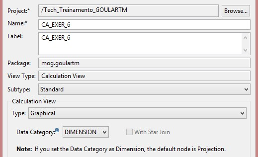{: .center}
&nbsp;

Adicione um novo node de **Aggregation** para tabela **SAPABAP1.SPFLI** fazendo um COUNT. Esse node trará o número de conexões de Departure de cada aeroporto:

&nbsp;
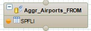{: .center}

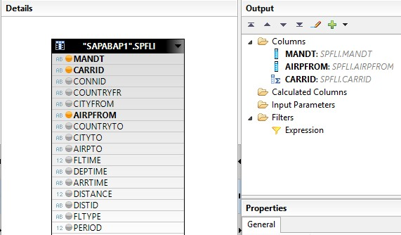{: .center}

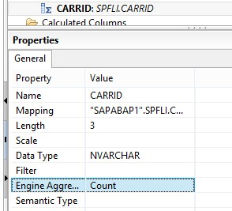{: .center}
&nbsp;

Renomeie o campo:

&nbsp;
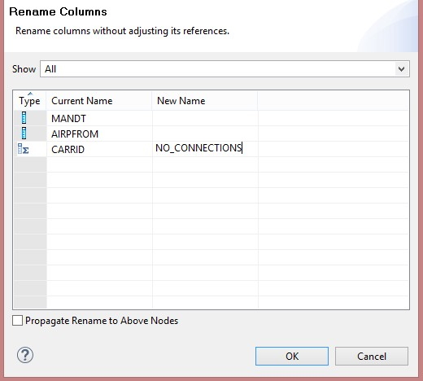{: .center}
&nbsp;

Adicione um novo node de **Aggregation** para tabela **SAPABAP1.SPFLI** fazendo um COUNT. Esse node trará o número de conexões de Arrive de cada aeroporto:

&nbsp;
{: .center}

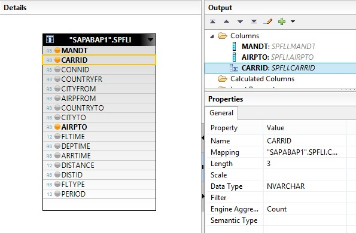{: .center}
&nbsp;

Renomeie o campo:

&nbsp;
{: .center}
&nbsp;

Adicione um node **Union** que fará a união entre as duas Aggregations criadas:

&nbsp;
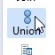{: .center}

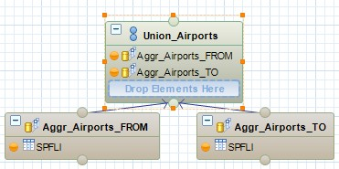{: .center}
&nbsp;

Faça a ligação dos campos do Union:

&nbsp;
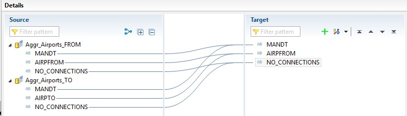{: .center}
&nbsp;

Adicione uma nova **Projection** que receberá o resultado do node **Union_Airports**:

&nbsp;
{: .center}
&nbsp;

Nesse node faremos a conversão do campo NO_CONNECTIONS de NVCARCHAR para INTEGER. Para isso precisamos criar uma nova Calculated Column:

```
int( "NO_CONNECTIONS" )
```
&nbsp;
{: .center}

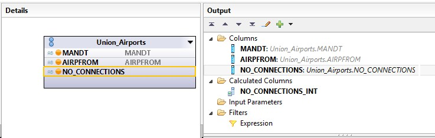{: .center}
&nbsp;

Adicione um novo node **Aggregation** que fará a somatória das conexões:

&nbsp;
{: .center}

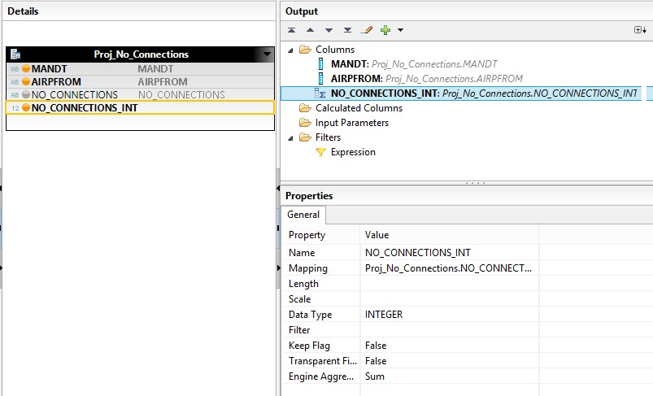{: .center}
&nbsp;

Adicione a Aggregation **Aggr_No_Connections** à Projection final de saída da Calculation View: 

&nbsp;
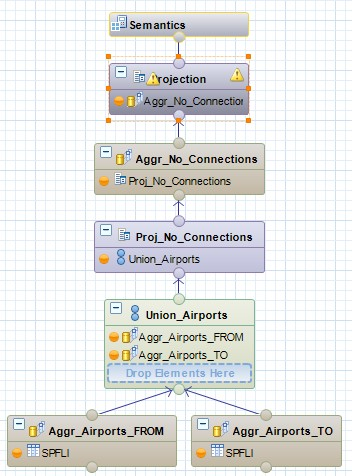{: .center}

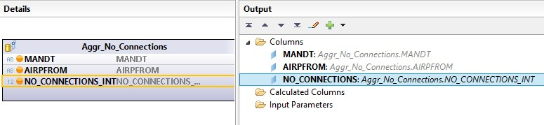{: .center}
&nbsp;

Na aba de **Semantics**, defina os campos de chave primária e mude o **Default Client** na aba de **Properties**:

&nbsp;
{: .center}

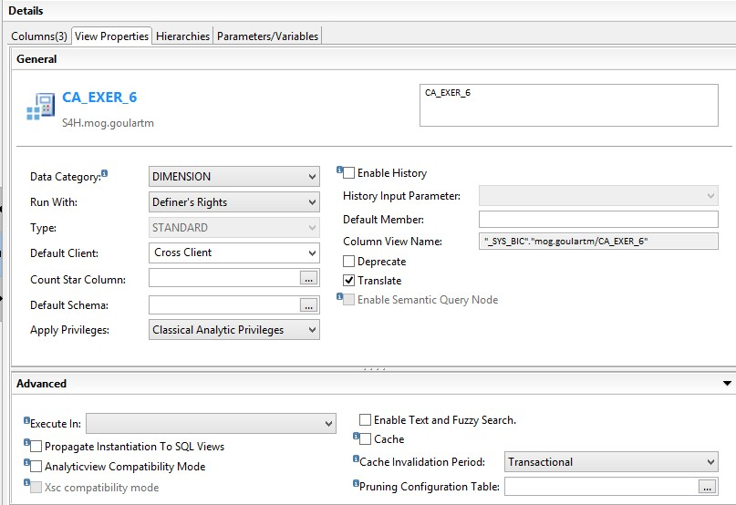{: .center}
&nbsp;

Salve, ative e teste a view.

&nbsp;
{: .center}
&nbsp;