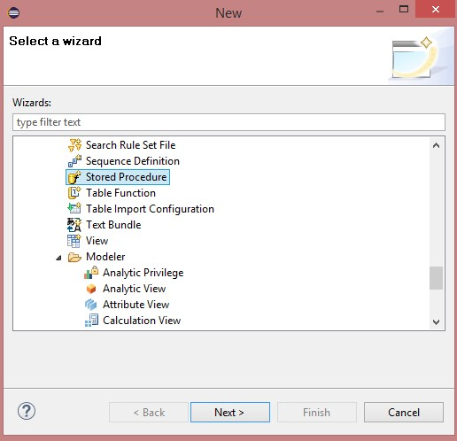
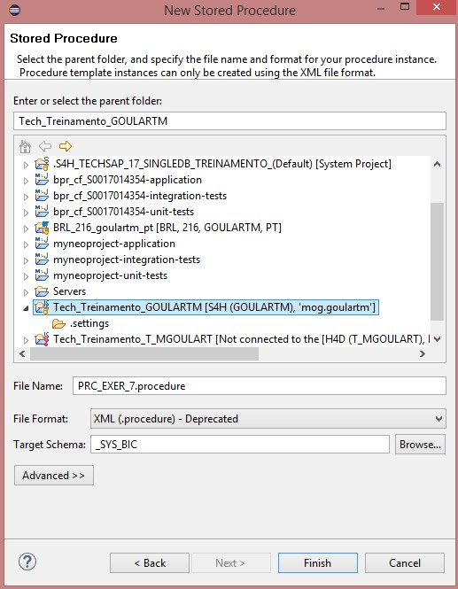
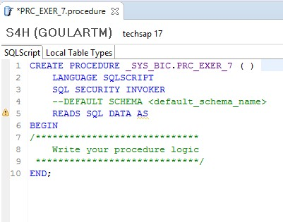
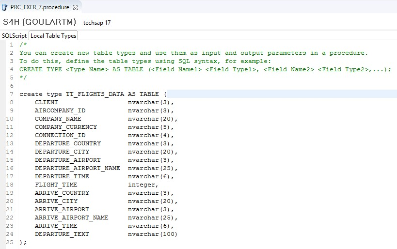
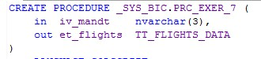
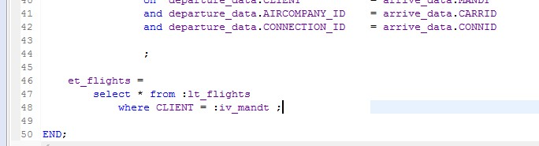
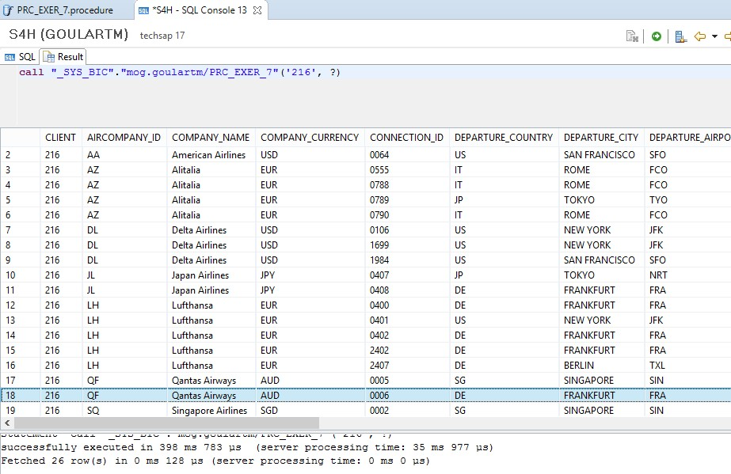

#Exercício 7 - HANA

&nbsp;
## Contexto
&nbsp;

Criar uma procedure que traga dados de conexões (SPFLI) com dados de partida e chegada dos voos. Mesma lógica do Exercício 3, porém fazendo todas as lógicas dentro da procedure (utilizar as views CA_EXER_1 e CA_EXER_2). 
A view deve retornar as seguintes informações: 

&nbsp;

| Campo | Tipo de Dados | Origem |
| ----- | ------------- | ------ |
| CLIENT | nvarchar(3) | SPFLI-MANDT |
| AIRCOMPANY_ID | nvarchar(3) | SPFLI-CARRID |
| COMPANY_NAME | nvarchar(20) | SCARR-CARRNAME |
| COMPANY_CURRENCY | nvarchar(5) | SCARR-CURRCODE |
| CONNECTION_ID | nvarchar(4) | SPFLI-CONNID |
| DEPARTURE_COUNTRY | nvarchar(3) | SPFLI-COUNTRYFR |
| DEPARTURE_CITY | nvarchar(20) | SPFLI-CITYFROM |
| DEPARTURE_AIRPORT | nvarchar(3) | SPFLI-AIRPFROM |
| DEPARTURE_AIRPORT_NAME | nvarchar(25) | SAIRPORT-NAME |
| DEPARTURE_TIME | nvarchar(6) | SPFLI-DEPTIME |
| FLIGHT_TIME | integer | SPFLI-FLTIME |
| ARRIVE_COUNTRY | nvarchar(3) | SPFLI-COUNTRYTO |
| ARRIVE_CITY | nvarchar(20) | SPFLI-CITYTO |
| ARRIVE_AIRPORT | nvarchar(3) | SPFLI-AIRPTO |
| ARRIVE_AIRPORT_NAME | nvarchar(25) | SAIRPORT-NAME |
| ARRIVE_TIME | nvarchar(6) | SPFLI-ARRTIME
| DEPARTURE_TEXT | nvarchar(100) | Calculated Column |

| Calculated Column | Valor | Tipo |
| ----------------- | ----- | ---- |
| DEPARTURE_TEXT | Concatenar campos DEPARTURE_COUNTRY + DEPARTURE_CITY + DEPARTURE_AIRPORT_NAME + DEPARTURE_TIME | NVARCHAR(100) |

&nbsp;
## Calculation View
&nbsp;

Crie uma nova Stored Procedure:

&nbsp;
{: .center}
&nbsp;

Crie como uma procedure do tipo **XML (.procedure)**, pois esse é o tipo de procedure que é suportado pelo ABAP. Caso a procedure não seja utilizada no ABAP, sempre crie como tipo Text **(.hdbprocedure)**:

&nbsp;
{: .center}

{: .center}

{: .center}
&nbsp;

Crie o tipo de saída da procedure: 

```
create type TT_FLIGHTS_DATA AS TABLE (
	CLIENT 					nvarchar(3), 
	AIRCOMPANY_ID 			nvarchar(3), 
	COMPANY_NAME 			nvarchar(20),
	COMPANY_CURRENCY		nvarchar(5),
	CONNECTION_ID			nvarchar(4), 
	DEPARTURE_COUNTRY		nvarchar(3),
	DEPARTURE_CITY			nvarchar(20),
	DEPARTURE_AIRPORT		nvarchar(3),
	DEPARTURE_AIRPORT_NAME	nvarchar(25),
	DEPARTURE_TIME			nvarchar(6),
	FLIGHT_TIME				integer,
	ARRIVE_COUNTRY			nvarchar(3),
	ARRIVE_CITY				nvarchar(20),
	ARRIVE_AIRPORT			nvarchar(3),
	ARRIVE_AIRPORT_NAME		nvarchar(25),
	ARRIVE_TIME				nvarchar(6),
	DEPARTURE_TEXT			nvarchar(100)
); 
```
&nbsp;
{: .center}
&nbsp;

Informe os parâmetros de saída:

&nbsp;
{: .center}
&nbsp;

Faça a seleção dos dados utilizando as views do exercício 1 e 2:

```
  lt_flights = 
  	select 
  		departure_data.CLIENT 					,
		departure_data.AIRCOMPANY_ID 			,
		departure_data.COMPANY_NAME 			,
		departure_data.COMPANY_CURRENCY		,
		departure_data.CONNECTION_ID			,
		departure_data.DEPARTURE_COUNTRY		,
		departure_data.DEPARTURE_CITY			,
		departure_data.DEPARTURE_AIRPORT		,
		departure_data.DEPARTURE_AIRPORT_NAME	,
		departure_data.DEPARTURE_TIME			,
		departure_data.FLIGHT_TIME				,		
		arrive_data.COUNTRYTO 	as ARRIVE_COUNTRY			,
		arrive_data.CITYTO 		as ARRIVE_CITY				,
		arrive_data.AIRPTO		as ARRIVE_AIRPORT			,
		arrive_data.NAME 		as ARRIVE_AIRPORT_NAME		,
		arrive_data.ARRTIME 	as ARRIVE_TIME				,		
		concat( "DEPARTURE_COUNTRY", concat( '/',
			concat( "DEPARTURE_CITY", concat( ' - ', 
				concat( "DEPARTURE_AIRPORT_NAME", concat( ' - ', 
					TO_NVARCHAR( to_time( "DEPARTURE_TIME" ) , 'HH:mm:SS' ) ) 
		) ) ) ) )				as DEPARTURE_TEXT

			from "mog.goulartm::CA_EXER_1" as departure_data			
			inner join "mog.goulartm::CA_EXER_2" as arrive_data
				on	departure_data.CLIENT 			= arrive_data.MANDT
				and departure_data.AIRCOMPANY_ID 	= arrive_data.CARRID
				and departure_data.CONNECTION_ID	= arrive_data.CONNID
				
				;
```
&nbsp;
{: .center}
&nbsp;

Preencha a estrutura de saída:

```
	et_flights = 
		select * from :lt_flights
			where CLIENT = :iv_mandt ;	
```
&nbsp;
{: .center}
&nbsp;

Salve, ative e teste a procedure.

&nbsp;
{: .center}
&nbsp;