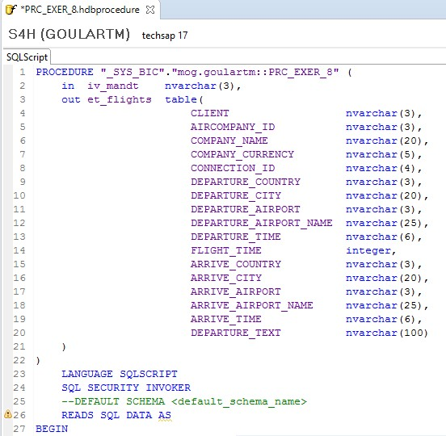
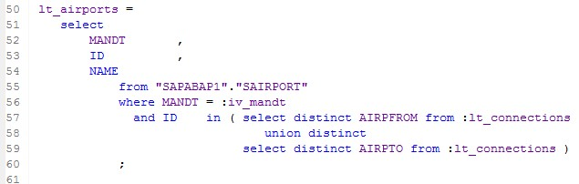
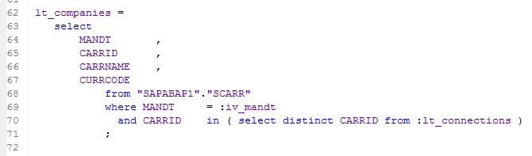
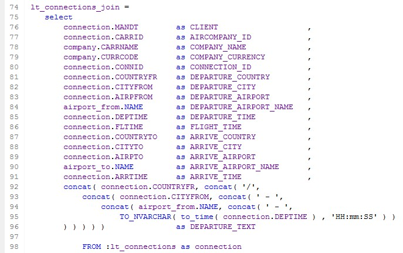
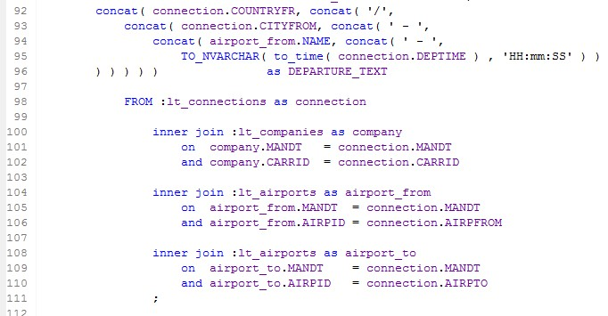
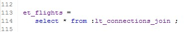
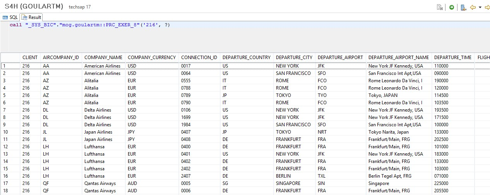

#Exercício 8 - HANA

&nbsp;
## Contexto
&nbsp;

Criar uma procedure que traga dados de conexões (SPFLI) com dados de partida e chegada dos voos. Mesma lógica do Exercício 3, porém fazendo todas as lógicas dentro da procedure (não utilizar as views CA_EXER_1 e CA_EXER_2, fazer toda lógica dentro da procedure).  
A view deve retornar as seguintes informações: 

&nbsp;

| Campo | Tipo de Dados | Origem |
| ----- | ------------- | ------ |
| CLIENT | nvarchar(3) | SPFLI-MANDT |
| AIRCOMPANY_ID | nvarchar(3) | SPFLI-CARRID |
| COMPANY_NAME | nvarchar(20) | SCARR-CARRNAME |
| COMPANY_CURRENCY | nvarchar(5) | SCARR-CURRCODE |
| CONNECTION_ID | nvarchar(4) | SPFLI-CONNID |
| DEPARTURE_COUNTRY | nvarchar(3) | SPFLI-COUNTRYFR |
| DEPARTURE_CITY | nvarchar(20) | SPFLI-CITYFROM |
| DEPARTURE_AIRPORT | nvarchar(3) | SPFLI-AIRPFROM |
| DEPARTURE_AIRPORT_NAME | nvarchar(25) | SAIRPORT-NAME |
| DEPARTURE_TIME | nvarchar(6) | SPFLI-DEPTIME |
| FLIGHT_TIME | integer | SPFLI-FLTIME |
| ARRIVE_COUNTRY | nvarchar(3) | SPFLI-COUNTRYTO |
| ARRIVE_CITY | nvarchar(20) | SPFLI-CITYTO |
| ARRIVE_AIRPORT | nvarchar(3) | SPFLI-AIRPTO |
| ARRIVE_AIRPORT_NAME | nvarchar(25) | SAIRPORT-NAME |
| ARRIVE_TIME | nvarchar(6) | SPFLI-ARRTIME
| DEPARTURE_TEXT | nvarchar(100) | Calculated Column |

| Calculated Column | Valor | Tipo |
| ----------------- | ----- | ---- |
| DEPARTURE_TEXT | Concatenar campos DEPARTURE_COUNTRY + DEPARTURE_CITY + DEPARTURE_AIRPORT_NAME + DEPARTURE_TIME | NVARCHAR(100) |

&nbsp;
## Calculation View
&nbsp;

Crie uma nova Stored Procedure do tipo **Text** (.hdbprocedure):

&nbsp;
{: .center}
&nbsp;

Defina os parâmetros de entrada e de saída da procedure: 

```
	in 	iv_mandt 	nvarchar(3),
	out et_flights	table( 
						CLIENT 					nvarchar(3), 
						AIRCOMPANY_ID 			nvarchar(3), 
						COMPANY_NAME 			nvarchar(20),
						COMPANY_CURRENCY		nvarchar(5),
						CONNECTION_ID			nvarchar(4), 
						DEPARTURE_COUNTRY		nvarchar(3),
						DEPARTURE_CITY			nvarchar(20),
						DEPARTURE_AIRPORT		nvarchar(3),
						DEPARTURE_AIRPORT_NAME	nvarchar(25),
						DEPARTURE_TIME			nvarchar(6),
						FLIGHT_TIME				integer,
						ARRIVE_COUNTRY			nvarchar(3),
						ARRIVE_CITY				nvarchar(20),
						ARRIVE_AIRPORT			nvarchar(3),
						ARRIVE_AIRPORT_NAME		nvarchar(25),
						ARRIVE_TIME				nvarchar(6),
						DEPARTURE_TEXT			nvarchar(100)	
```
&nbsp;
{: .center}
&nbsp;

Faça uma query para trazer os dados das conexões (SAPABAP1.SPFLI):

```
 lt_connections = 
 	select 
 		MANDT		, 
 		CARRID		, 
 		CONNID		, 
 		COUNTRYFR	, 
 		CITYFROM	, 
 		AIRPFROM	, 
 		DEPTIME		,
 		FLTIME		, 
 		COUNTRYTO	, 
 		CITYTO		,
 		AIRPTO		, 
 		ARRTIME 
 			from "SAPABAP1"."SPFLI" 
 			where MANDT = :iv_mandt 
 			; 
```
&nbsp;
{: .center}
&nbsp;

Traga os dados de aeroportos (SAPABAP1.SAIRPORT):

```
  lt_airports = 
 	select
 		MANDT			, 
 		ID	as AIRPID	,
 		NAME
 			from "SAPABAP1"."SAIRPORT"
 			where MANDT = :iv_mandt
 			  and ID	in ( select distinct AIRPFROM from :lt_connections 
 			  					union distinct
 			  				 select distinct AIRPTO from :lt_connections )
			;
```
&nbsp;
{: .center}
&nbsp;

Traga os dados de companhias aéreas (SAPABAP1.SCARR):

```
  lt_companies = 
 	select 
 		MANDT		, 
 		CARRID		,
 		CARRNAME	, 
 		CURRCODE
 			from "SAPABAP1"."SCARR"
 			where MANDT 	= :iv_mandt
 			  and CARRID 	in ( select distinct CARRID from :lt_connections ) 
			; 
```
&nbsp;
{: .center}
&nbsp;

Faça a junção das 3 entidades, compondo os dados com os campos utilizados pela sua estrutura de saída da procedure:

```
 lt_connections_join = 
 	select 
		connection.MANDT 		as CLIENT 					,
		connection.CARRID 		as AIRCOMPANY_ID 			,
		company.CARRNAME		as COMPANY_NAME 			,
		company.CURRCODE		as COMPANY_CURRENCY			,
		connection.CONNID		as CONNECTION_ID			,
		connection.COUNTRYFR	as DEPARTURE_COUNTRY		,
		connection.CITYFROM		as DEPARTURE_CITY			,
		connection.AIRPFROM		as DEPARTURE_AIRPORT		,
		airport_from.NAME		as DEPARTURE_AIRPORT_NAME	,
		connection.DEPTIME		as DEPARTURE_TIME			,
		connection.FLTIME		as FLIGHT_TIME				,
		connection.COUNTRYTO	as ARRIVE_COUNTRY			,
		connection.CITYTO		as ARRIVE_CITY				,
		connection.AIRPTO		as ARRIVE_AIRPORT			,
		airport_to.NAME			as ARRIVE_AIRPORT_NAME		,
		connection.ARRTIME		as ARRIVE_TIME				,
		concat( connection.COUNTRYFR, concat( '/',
			concat( connection.CITYFROM, concat( ' - ', 
				concat( airport_from.NAME, concat( ' - ', 
					TO_NVARCHAR( to_time( connection.DEPTIME ) , 'HH:mm:SS' ) ) 
		) ) ) ) ) 				as DEPARTURE_TEXT		 	
			
			FROM :lt_connections as connection
				
				inner join :lt_companies as company
					on	company.MANDT	= connection.MANDT
					and company.CARRID	= connection.CARRID
					
				inner join :lt_airports as airport_from
					on	airport_from.MANDT 	= connection.MANDT
					and airport_from.AIRPID	= connection.AIRPFROM
				
				inner join :lt_airports as airport_to
					on	airport_to.MANDT 	= connection.MANDT
					and airport_to.AIRPID	= connection.AIRPTO
				;
```
&nbsp;
{: .center}

{: .center}
&nbsp;

Preencha a estrutura de saída da procedure:

```
 et_flights = 
 	select * from :lt_connections_join ;
``` 	
&nbsp;
{: .center}
&nbsp;

Salve, ative e teste a procedure.

&nbsp;
{: .center}
&nbsp;