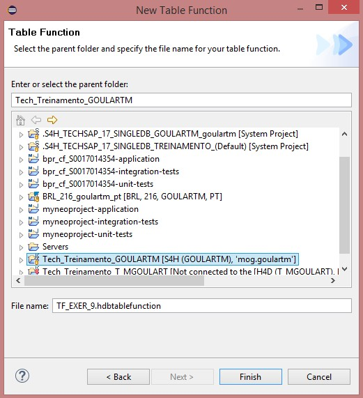
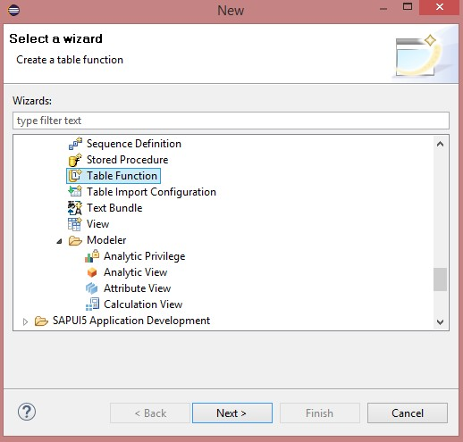
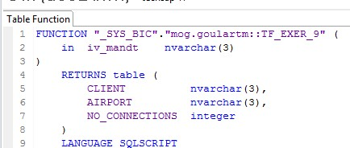
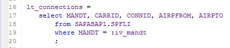
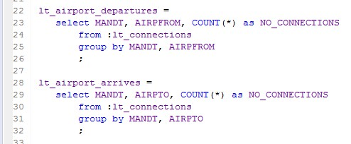
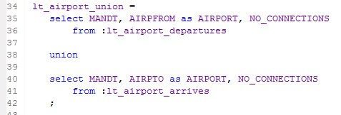
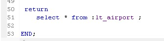

#Exercício 9 - HANA

&nbsp;
## Contexto
&nbsp;

Criar uma table function que traga dados de quantas vezes os aeroportos foram destinos de conexões (ARRIVE e DEPARTURE), tendo assim uma relação dos aeroportos com maior número de conexões.

A view deve retornar as seguintes informações: 

&nbsp;

| Campo | Origem | Tipo de Dados |
| ----- | ------ | ------------- |
| CLIENT | SPFLI-MANDT | nvarchar(3) |
| AIRPORT | SPFLI-AIRPFROM e SPFLI-AIRPTO (UNION) | nvarchar(3) |
| NO_CONNECTIONS | COUNT(*) | integer |

&nbsp;
## Table Function
&nbsp;

Crie uma table function:

&nbsp;
{: .center}

{: .center}

{: .center}
&nbsp;

Defina a estrutura de **Return** da table function e os parâmetros de entrada:

```
FUNCTION "_SYS_BIC"."mog.goulartm::TF_EXER_9" ( 
	in	iv_mandt	nvarchar(3)
) 

RETURNS table (
		CLIENT			nvarchar(3),
		AIRPORT			nvarchar(3),
		NO_CONNECTIONS	integer
	)
```
&nbsp;
{: .center}
&nbsp;

Busque os dados de conexões na tabela **SAPABAP1.SPFLI**:

&nbsp;
{: .center}
&nbsp;

Faça duas agregações, uma que mostre a quantidade de vezes que um aeroporto é utilizado como origem de uma conexão (departure), e outra que mostra a quantidade de vezes que um aeroporto  é utilizado como destino de uma conexão (arrive):

&nbsp;
{: .center}
&nbsp;

Faça um union das duas agregações:

&nbsp;
{: .center}
&nbsp;

Somar as utilizações por aeroporto: 

&nbsp;
{: .center}
&nbsp;

Faça o return da table function:

&nbsp;
{: .center}
&nbsp;

Salve, ative e teste:

&nbsp;
{: .center}
&nbsp;